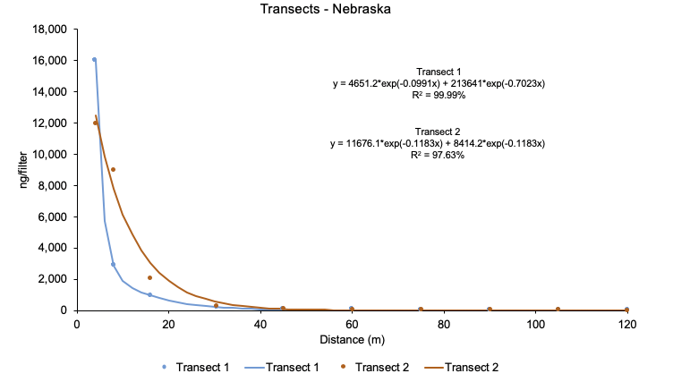
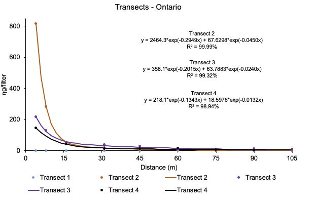

```{r include=FALSE}
library(ggplot2)
library(tidyverse)
library(drc)
library(knitr)
library(kableExtra)
library(ggthemes)
library(ggplot2)
library(RColorBrewer)
library(CircStats)
library(openair)
library(scales)
```


```{r, echo=FALSE, out.width = '80%', fig.align="center", fig.pos='h'}
knitr::include_graphics("injury.jpg")
```


\newpage 
\tableofcontents 
\newpage 
\listoffigures
\newpage 
\listoftables
\newpage


# PROJECT LEADER


## Bayer Crop Science
**Bayer Crop Science**: [Dr. Ryan Rector](https://www.cropscience.bayer.com/en)

## Arkansas
**University of Arkansas**: [Dr. Jason Norsworthy](https://crop-soil-environmental-sciences.uark.edu/directory/index/uid/jnorswor/name/Jason-Norsworthy/)

## Indiana
**Purdue University**: [Dr. Bryan Young](https://ag.purdue.edu/btny/Pages/profile.aspx?strAlias=young285)

## Michigan
**Michigan State University**: [Dr. Christy Sprage](https://www.canr.msu.edu/people/christy_sprague)

## Nebraska
**University of Nebraska-Lincoln**: [Dr. Greg Kruger](https://agronomy.unl.edu/kruger)

## Ontario
**University of Guelph**: [Dr. Peter Sikkema](https://www.plant.uoguelph.ca/psikkema)

## Wisconsin
**University of Wisconsin-Madison**: [Dr. Rodrigo Werle](http://www.wiscweeds.info/)


\newpage

# ARKANSAS

```{r include=FALSE}
AR=read_csv("arkansas.csv")
str(AR)
```


## Location

The study was conducted in a soybean field at Proctor, Arkansas (Figure 1)

```{r, echo=FALSE, fig.cap="Aerial view of the large scale volatility trial in Arkansas.", out.width = '100%', fig.align="center", fig.retina = 2, fig.pos='h'}

```


\newpage


## Modeling

Non-Xtend **soybean injury (%)** (visual data) from Arkansas presented here was collected in from one soybean plant distance^-1^ at 22 and 29 days after treatment (DAT) but without replication. Nonetheless, we use the three-parameter logistic model (Equation 1) for fitting soybean injury (%) with distance from the area treated with dicamba. 

Equation 1: $$Y= \frac{d}{(1 + exp[b(logx - loge)]} $$

where *Y* is the soybean injury (%), *x* is the distance (m) from the dicamba treated area. in The parameter *d* is the upper limit (asymptote), *b* is the slope and the parameter *e* is the ED50 (effective *x* that causes 50% reduction in *Y*). Data from 22 and 29 DAT are presented.

Non-Xtend **soybean height** (cm) from Arkansas presented here was collected from 10 soybean plant distance^-1^ at 22 DAT. *Loess* local regression was fitted to the data.

\pagebreak
\newpage

## Wind

Frequency of wind direction and speed (m/s) three days after dicamaba application (Figure X).

```{r include=FALSE, waring=F}
data=read.csv("wind.csv")
str(data)
data=filter(data, Location == "Arkansas")

#Run all this code
plot.windrose <- function(data,
                          spd,
                          dir,
                          spdres = 2,
                          dirres = 22.5,
                          spdmin = 0,
                          spdmax = 10,
                          spdseq = NULL,
                          palette="Greens",
                          countmax = NA,
                          debug = 0){


  # Look to see what data was passed in to the function
  if (is.numeric(spd) & is.numeric(dir)){
    # assume that we've been given vectors of the speed and direction vectors
    data <- data.frame(spd = spd,
                       dir = dir)
    spd = "spd"
    dir = "dir"
  } else if (exists("data")){
    # Assume that we've been given a data frame, and the name of the speed 
    # and direction columns. This is the format we want for later use.    
  }  

  # Tidy up input data ----
  n.in <- NROW(data)
  dnu <- (is.na(data[[spd]]) | is.na(data[[dir]]))
  data[[spd]][dnu] <- NA
  data[[dir]][dnu] <- NA

  # figure out the wind speed bins ----
  if (missing(spdseq)){
    spdseq <- seq(spdmin,spdmax,spdres)
  } else {
    if (debug >0){
      cat("Using custom speed bins \n")
    }
  }
  # get some information about the number of bins, etc.
  n.spd.seq <- length(spdseq)
  n.colors.in.range <- n.spd.seq - 1

  # create the color map
  spd.colors <- colorRampPalette(brewer.pal(min(max(3,
                                                    n.colors.in.range),
                                                min(9,
                                                    n.colors.in.range)),                                               
                                            palette))(n.colors.in.range)

  if (max(data[[spd]],na.rm = TRUE) > spdmax){    
    spd.breaks <- c(spdseq,
                    max(data[[spd]],na.rm = TRUE))
    spd.labels <- c(paste(c(spdseq[1:n.spd.seq-1]),
                          '-',
                          c(spdseq[2:n.spd.seq])),
                    paste(spdmax,
                          "-",
                          max(data[[spd]],na.rm = TRUE)))
    spd.colors <- c(spd.colors, "grey50")
  } else{
    spd.breaks <- spdseq
    spd.labels <- paste(c(spdseq[1:n.spd.seq-1]),
                        '-',
                        c(spdseq[2:n.spd.seq]))    
  }
  data$spd.binned <- cut(x = data[[spd]],
                         breaks = spd.breaks,
                         labels = spd.labels,
                         ordered_result = TRUE)

  # figure out the wind direction bins
  dir.breaks <- c(-dirres/2,
                  seq(dirres/2, 360-dirres/2, by = dirres),
                  360+dirres/2)  
  dir.labels <- c(paste(360-dirres/2,"-",dirres/2),
                  paste(seq(dirres/2, 360-3*dirres/2, by = dirres),
                        "-",
                        seq(3*dirres/2, 360-dirres/2, by = dirres)),
                  paste(360-dirres/2,"-",dirres/2))
  # assign each wind direction to a bin
  dir.binned <- cut(data[[dir]],
                    breaks = dir.breaks,
                    ordered_result = TRUE)
  levels(dir.binned) <- dir.labels
  data$dir.binned <- dir.binned

  # Run debug if required ----
  if (debug>0){    
    cat(dir.breaks,"\n")
    cat(dir.labels,"\n")
    cat(levels(dir.binned),"\n")

  }  

  # create the plot ----
  p.windrose <- ggplot(data = data,
                       aes(x = dir.binned,
                           fill = spd.binned
                           ,y = (..count..)/sum(..count..)
                           ))+
    geom_bar(size=0.2, color="black") + theme_stata() +
    scale_x_discrete(drop = FALSE,
labels = c("N","","NE","", "E", "", "SE","", 
             "S","", "SW","", "W","","NW","")) +
    coord_polar(start = -((dirres/2)/360) * 2*pi) +
    scale_fill_manual(name = "Wind Speed (m/s)", 
                      values = spd.colors,
                      drop = FALSE) +
    theme(axis.title.x = element_blank(), strip.text.x = element_text(size = 15, colour = "black", face="bold", angle = 0),
          axis.text=element_text(size=14, color="black"), 
        axis.title=element_text(size=18,face="bold"), 
        legend.position="right", legend.direction = "vertical", legend.box = "vertical", legend.text = element_text(colour="black", size = 12), legend.title = element_text(colour="black", size=12, face="bold"),
  panel.grid.minor = element_blank())  + facet_wrap(~Location) + 
    scale_y_continuous(labels = scales::percent_format(accuracy = 1)) +
    ylab("Frequency")

  # adjust axes if required
  if (!is.na(countmax)){
    p.windrose <- p.windrose +
      ylim(c(0,countmax))
  }

  # print the plot
  print(p.windrose)  

  # return the handle to the wind rose
  return(p.windrose)
}
```


```{r fig.pos='h', echo=FALSE, fig.height= 6, fig.width=8, fig.cap="Wind rose plots demonstrating the average wind frequency (%) and wind speed (m s^1^) grouped in 22.5° of direction (from which the wind is blowing) in Arkansas."}
plot<-plot.windrose(data = data,
              spd = "spd",
              dir = "dir") 
```

\pagebreak
\newpage

## Transects


\pagebreak
\newpage

## Results at 22 DAT

### Dicamba injury (%) in non-Xtend soybeans 

#### Area located in the **upwind** direction 1, 2, and 3

```{r include=FALSE}
AR1=filter(AR, Direction=="Upwind" & DAT=="22")
Model1=drm(Injury~Distance, Location, fct=l3(fixed = c(NA, NA, NA), names = c("slope", "asymptote", "ed50")), data=AR1)
summary(Model1)
ED(Model1, c(1,10,20), type="absolute")
EDcomp(Model1, c(1,1,10,10,20,20), type="absolute")
plot(Model1, col=c(1,2,3))
```

Table: Parameters of the log-logistic model at west upwind transects (1, 2, and 3) at 22 DAT in Arkansas.
 
|Parameter | Transect | Estimate (± SE) | t-value | p-value |
| ------------- | ------------- | ---------- |---------- |---------- |   
| Slope  | West Transect 1  |  3.99  ±  1.13 | 3.51 | 0.02 *
| Slope  | West Transect 2  |  3.87  ±  1.12 | 3.45 | 0.02 *    
| Slope  | West Transect 3  |  1.84  ±  0.88 | 2.08 | 0.10 
| Asymptote  | West Transect 1 | 44.92  ±  5.81 | 7.73 | 0.00 **
| Asymptote  | West Transect 2 |  52.59  ±  8.63 | 6.09 | 0.00 **
| Asymptote  | West Transect 3 |  117.40  ±  353.09 | 0.33 | 0.75 ***
| ED50  | West Transect 1 |  25.73 ±   3.11 | 8.25 | 0.00 **
| ED50  | West Transect 2  |  24.12 ±  3.59 | 6.71 | 0.00 **  
| ED50  | West Transect 3  |  8.54 ±  20.73 | 0.41 | 0.70 

 

Table: Estimation of the distance (m) that resulted in 1 (ED1), 10 (ED10), and 20% (ED20) injury on non-Xtend soybeans at westupwind transects  (1, 2, and 3) at 22 DAT in Arkansas.

| Transect | ED1 (m) (± SE) | ED10 (m) (± SE)| ED20 (m) (± SE)
| ------------- | ------------- | ---------- |---------- |
| West Transect 1 | 66.36  ±  11.30 | 35.20  ±  2.04 | 27.19 ± 2.92
| West Transect 2 | 66.82  ±  11.08 | 35.07  ±  2.19 | 27.36 ± 3.16
| West Transect 3 | 111.95  ±  140.36 | 30.85  ±  56.57 | 20.11  ±  40.84


Table: Comparison of EDs among west  upwind transects (1, 2, and 3) at 22 DAT in Arkansas.

|Comparison | Estimate (± SE) | t-value | p-value |         
| ------------- | ------------- | ---------- |---------- |
|West Transect 1/West Transect 2:E1/E1 | 0.99 ± 0.23 | -0.02 | 0.97
|West Transect 1/West Transect 3:E1/E1 | 0.59 ± 0.75 | -0.53 |  0.61
|West Transect 2/West Transect 3:E1/E1 | 0.59 ± 0.76 | -0.53 | 0.62
|West Transect 1/West Transect 2:E10/E10 | 1.00 ± 0.08 | 0.04  | 0.96
|West Transect 1/West Transect 3:E10/E10 | 1.14 ± 2.11 | 0.06 | 0.94
|West Transect 2/West Transect 3:E10/E10 | 1.13 ± 2.10 | 0.06 | 0.95
|West Transect 1/West Transect 2:E20/E20 | 0.99 ± 0.15 | -0.04 | 0.96 
|West Transect 1/West Transect 3:E20/E20 | 1.35 ± 2.77 | 0.12 | 0.90
|West Transect 2/West Transect 3:E20/E20 | 1.36 ± 2.79  | 0.13  | 0.90


```{r warning=FALSE, include=FALSE}
newdata <- expand.grid(Distance=exp(seq(log(14), log(81), length=81)))
newdata1 <- data.frame(Location ="West Transect 1", newdata) 
newdata2 <- data.frame(Location ="West Transect 2", newdata)
newdata3 <- data.frame(Location ="West Transect 3", newdata)


nd=rbind(newdata1, newdata2, newdata3)

pm <- predict(Model1, newdata=nd, interval="confidence")


nd$p <- pm[,1] 
nd$pmin <- pm[,2]   
nd$pmax <- pm[,3] 


AR1$Distance0 <- AR1$Distance 
AR1$Distance0[AR1$h0==0] <- 14 
```

```{r echo=FALSE, fig.cap="Non-Xtend soybean injury (%) with distance (%) from the dicamba treated area in the upwind west transect 1, 2, and 3 in Arkansas at 22 DAT.", fig.height=6, fig.width=6, warning=FALSE}
ggplot(AR1, aes(x = Distance0, y = Injury, linetype=Location, color=Location)) + geom_point(size=2) + theme_stata() +
geom_line(data=nd, aes(x=Distance, y=p, linetype=Location, color=Location), size=1.3) + coord_trans(x="log") +
  labs(fill="", y="Non-Xtend soybean injury (%)", x="Distance (m)", caption = "Source: University of Arkansas Weed Science, 2018") +
  scale_fill_brewer(palette="Paired") + ylim(0,50) +
  theme(plot.caption = element_text(size=10), legend.title = element_blank(), legend.text = element_text(size=12)) +
  scale_x_continuous(breaks=c(15, 20, 30, 40, 80)) 
```


\pagebreak
\newpage

#### Area located in the **downwind** direction 1, 2, and 3.

```{r include=FALSE}
AR2=filter(AR, Direction=="Downwind" & DAT=="22")
Model3=drm(Injury~Distance, Location, fct=l3(), data=AR2)
summary(Model3)
ED(Model3, c(1,10,20), type="absolute")
EDcomp(Model3, c(1,1,10,10,20,20), type="absolute")
plot(Model3)
```


Table: Parameters of the log-logistic model at east downwind transects (1, 2, and 3) at 22 DAT in Arkansas.
 
|Parameter | Transect | Estimate (± SE) | t-value | p-value |
| ------------- | ------------- | ---------- |---------- |---------- |   
| Slope  | East Transect 1  |  3.44  ±  0.35 | 9.60 | 0.00 ***
| Slope  | East Transect 2  |  2.46  ±  0.22 | 10.82 | 0.00 ***   
| Slope  | East Transect 3  |  2.03  ±  0.22 | 9.26 | 0.00 ***
| Asymptote  | East Transect 1 | 50.26  ±  1.97 | 25.47 | 0.00 ***
| Asymptote  | East Transect 2 |  52.20  ±  2.35 | 22.18 | 0.00 ***
| Asymptote  | East Transect 3 |  51.90  ±  4.07 | 12.72 | 0.00 ***
| ED50  | East Transect 1 |  69.44 ± 2.95 | 23.47 | 0.00 ***
| ED50  | East Transect 2  | 71.08 ±  4.18 | 17.00 | 0.00 *** 
| ED50  | East Transect 3  | 52.02 ±  6.01 | 8.64 | 0.00 ***

 

Table: Estimation of the distance (m) that resulted in 1 (ED1), 10 (ED10), and 20% (ED20) injury on non-Xtend soybeans at east downwind transects (1, 2, and 3) at 22 DAT in Arkansas.

| Transect | ED1 (m) (± SE) | ED10 (m) (± SE)| ED20 (m) (± SE)
| ------------- | ------------- | ---------- |---------- |
| West Transect 1 | 215.55 ± 22.21 | 104.09 ± 4.36 | 78.32 ± 2.95
| West Transect 2 | 350.70 ± 41.41 | 127.46 ± 6.04 | 86.23 ± 4.23
| West Transect 3 | 358.72 ± 47.04 | 105.18 ± 7.22 | 65.44 ± 6.30


Table: Comparison of EDs among east downwind transects (1, 2, and 3) at 22 DAT in Arkansas.

|Comparison | Estimate (± SE) | t-value | p-value |         
| ------------- | ------------- | ---------- |---------- |
|EastTransect 1/East Transect 2:E1/E1 | 0.61 ± 0.09 | -4.00 | 0.00 
|East Transect 1/East Transect 3:E1/E1 | 0.60 ± 0.10 | -3.98 | 0.00
|East Transect 2/East Transect 3:E1/E1 | 0.97 ± 0.17 | -0.12 | 0.89
|East Transect 1/East Transect 2:E10/E10 | 0.81 ± 0.05 | -3.54 | 0.00
|East Transect 1/East Transect 3:E10/E10 | 0.98 ± 0.07 | -0.12 | 0.89
|East Transect 2/East Transect 3:E10/E10 | 1.21 ± -0.10 | 2.09 | 0.04
|East Transect 1/East Transect 2:E20/E20 | 0.90 ± 0.05 | -1.63 | 0.11
|East Transect 1/East Transect 3:E20/E20 | 1.19 ± 0.12 | 1.58 | -0.11
|East Transect 2/East Transect 3:E20/E20 | 1.32 ± 0.14  | 2.22  | -0.03


```{r include=FALSE} 
newdata <- expand.grid(Distance=exp(seq(log(14), log(301), length=301)))
newdata1 <- data.frame(Location ="East Transect 1", newdata) 
newdata2 <- data.frame(Location ="East Transect 2", newdata)
newdata3 <- data.frame(Location ="East Transect 3", newdata)


nd=rbind(newdata1, newdata2, newdata3)

pm <- predict(Model3, newdata=nd, interval="confidence")


nd$p <- pm[,1] 
nd$pmin <- pm[,2]   
nd$pmax <- pm[,3] 


AR2$Distance0 <- AR2$Distance 
AR2$Distance0[AR2$h0==0] <- 14 
```


```{r warning=FALSE, echo=FALSE, fig.height= 6, fig.width=6, fig.cap="Non-Xtend soybean injury (%) with distance (m) from the dicamba treated area in the downwind east transect 1, 2, and 3 in Arkansas at 22 DAT."}
ggplot(AR2, aes(x = Distance0, y = Injury, linetype=Location, color=Location)) + geom_point(size=2) + theme_stata() +
geom_line(data=nd, aes(x=Distance, y=p, linetype=Location, color=Location), size=1.3) + coord_trans(x="log") +
  labs(fill="", y="Non-Xtend soybean injury (%)", x="Distance (m)", caption = "Source: University of Arkansas Weed Science, 2018") +
  scale_fill_brewer(palette="Paired") + ylim(0,50) +
  theme(plot.caption = element_text(size=10), legend.title = element_blank(), legend.text = element_text(size=12)) +
  scale_x_continuous(breaks=c(15, 20, 30, 40, 60, 80, 120, 200, 300)) 
```

\newpage

###  Non-Xtend soybeans height

#### Area located in the **upwind** direction 1, 2, and 3

```{r include=FALSE, warning=FALSE}
Height=read_csv("height.csv")
ARH=filter(Height, state=="Arkansas" & wind=="upwind")
```

```{r echo=FALSE, fig.height= 6, fig.width=6, warning=FALSE, fig.cap="Non-Xtend soybean height (cm) with distance (m) from the dicamba treated area in the upwind west transect 1, 2, and 3 in Arkansas at 22 DAT."}
#Model2=drm(height~distance, location, fct=l3(fixed = c(NA, NA, NA), names = c("slope", "asymptote", "ed50")), data=ARH)

ggplot(ARH, aes(distance, height, color=location, fill=location)) + geom_smooth(method="loess") +  theme_stata() + 
  scale_fill_brewer(palette="Paired") + ylim(60,100) +
  theme(plot.caption = element_text(size=10), legend.title = element_blank(), legend.text = element_text(size=12)) +
  scale_x_continuous(breaks=c(15, 20, 30, 40, 50, 60, 75)) + 
   labs(y="Non-Xtend soybean height (cm)", x="Distance (m)", caption = "Source: University of Arkansas Weed Science, 2018") 
```

\pagebreak
\newpage

####  Non-Xtend soybeans height

#### Area located in the **downwind** direction 1, 2, and 3

```{r include=FALSE, warning=FALSE}
Height=read_csv("height.csv")
ARH1=filter(Height, state=="Arkansas" & wind=="downwind")
```

```{r echo=FALSE, fig.height= 6, fig.width=6, warning=FALSE, fig.cap="Non-Xtend soybean injury (%) with distance (m) from the dicamba treated area in the downwind east transect 1, 2, and 3 in Arkansas at 22 DAT."}
#Model4=drm(height~distance, location, fct=l3(fixed = c(NA, NA, NA), names = c("slope", "asymptote", "ed50")), data=ARH1)


ggplot(ARH1, aes(distance, height, color=location, fill=location)) + geom_smooth(method="loess") + theme_stata() + 
  scale_fill_brewer(palette="Paired") +ylim(60,100) +
  theme(plot.caption = element_text(size=10), legend.title = element_blank(), legend.text = element_text(size=12)) +
  scale_x_continuous(breaks=c(15, 30, 40, 60, 80, 100, 120, 150, 200, 250)) +
   labs(y="Non-Xtend soybean height (cm)", x="Distance (m)", caption = "Source: University of Arkansas Weed Science, 2018") 
```

\pagebreak
\newpage

## Results at 29 DAT


### Dicamba injury (%) in non-Xtend soybeans

```{r include=FALSE}
AR3=filter(AR, DAT=="29")
Model5=drm(Injury~Distance, Location, fct=l3(), data=AR3)
summary(Model5)
ED(Model5, c(1,10,20), type="absolute")
EDcomp(Model5, c(1,1,10,10,20,20), type="absolute")
plot(Model5)
```


Table: Parameters of the log-logistic model of four sides of the treated area (N, E, S, W) at 29 DAT in Arkansas.
 
|Parameter | Transect | Estimate (± SE) | t-value | p-value |
| ------------- | ------------- | ---------- |---------- |---------- |   
| Slope  | N |  7.25  ±  1.75 | 4.13 | 0.00 ***
| Slope  | E |  1.82  ±  0.26 | 6.81 | 0.00 ***    
| Slope  | S |  2.62  ±  0.28 | 9.10 | 0.00 ***
| Slope  | W |  2.22  ±  0.32 | 6.95 | 0.00 ***
| Asymptote  | N | 45.54  ±  0.92 | 48.99 | 0.00 ***
| Asymptote  | E | 73.78  ±  12.36 | 5.96 | 0.00 ***
| Asymptote  | S | 57.18  ±  2.96 | 19.28 | 0.00 ***
| Asymptote  | W | 51.45  ±  4.65 | 11.05 | 0.00 ***
| ED50  | N |  273.69 ± 7.41 | 36.91 | 0.00 ***
| ED50  | E |  27.77 ± 6.36 | 4.36 | 0.00 *** 
| ED50  | S |  62.73 ± 4.09 | 15.30 | 0.00 *** 
| ED50  | W |  42.61 ±  5.06 | 8.42 | 0.00 ***

 

Table: Estimation of the distance (m) that resulted in 1 (ED1), 10 (ED10), and 20% (ED20) injury on non-Xtend soybeans of four sides of the treated area (N, E, S, W) at 29 DAT in Arkansas.

| Transect | ED1 (m) (± SE) | ED10 (m) (± SE)| ED20 (m) (± SE)
| ------------- | ------------- | ---------- |---------- |
| N | 461.94  ±  67.33 | 325.98  ±  20.67 | 283.10 ± 9.34
| E | 292.17  ±  50.04 | 76.79  ±  8.82 | 47.80 ± 7.70
| S | 291.65  ±  39.08 | 113.37  ±  5.99 | 79.47  ± 4.10
| W | 247.68  ±  44.95 | 80.67  ±  6.31 | 52.21  ±  5.15


\newpage

Table: Comparison of EDs among four sides of the treated area (N, E, S, W) at 29 DAT in Arkansas.

|Comparison | Estimate (± SE) | t-value | p-value |         
| ------------- | ------------- | ---------- |---------- |
|E/N:ED1/ED1 | 0.63 ± 0.14 | -2.58 | 0.01
|E/S:ED1/ED1 | 1.00 ± 0.21 | 0.00 | 0.99
|E/W:ED1/ED1 | 1.17 ± 0.29 | 0.61 | 0.54
|N/S:ED1/ED1 | 1.58 ± 0.31 | 1.86 | 0.06
|N/W:ED1/ED1 | 1.86 ± 0.43 | 1.99 | 0.05
|S/W:ED1/ED1 | 1.17 ± 0.26 | 0.66 | 0.50
|E/N:ED10/ED10 | 0.23 ± 0.03 | -24.7 | 0.00
|E/S:ED10/ED10 | 0.67 ± 0.08 | -3.76 | 0.00
|E/W:ED10/ED10 | 0.95 ± 0.13 | -0.36 | 0.71
|N/S:ED10/ED10 | 2.87 ± 0.23 | 7.90  | 0.00
|N/W:ED10/ED10 | 4.04 ± 0.40 | 7.46 | 0.00
|S/W:ED10/ED10 | 1.40 ± 0.13 | 3.05 | 0.00
|E/N:ED20/ED20 | 0.16 ± 0.02 | -2.99 | 0.00
|E/S:ED20/ED20 | 0.60 ± 0.10 | -3.91 | 0.00
|E/W:ED20/ED20 | 0.91 ± 0.17 | -0.48 | 0.06
|N/S:ED20/ED20 | 3.56 ± 0.21 | 1.17  | 0.00
|N/W:ED20/ED20 | 5.42 ± 0.56 | 7.83 | 0.00
|S/W:ED20/ED20 | 1.52 ± 0.16 | 3.08 | 0.00


```{r include=FALSE} 
newdata <- expand.grid(Distance=exp(seq(log(15), log(275), length=275)))
newdata1 <- data.frame(Location ="N", newdata) 
newdata2 <- data.frame(Location ="E", newdata)
newdata3 <- data.frame(Location ="S", newdata)
newdata4 <- data.frame(Location ="W", newdata)

nd=rbind(newdata1, newdata2, newdata3, newdata4)

pm <- predict(Model5, newdata=nd, interval="confidence")


nd$p <- pm[,1] 
nd$pmin <- pm[,2]   
nd$pmax <- pm[,3] 


AR3$Distance0 <- AR3$Distance 
AR3$Distance0[AR3$h0==0] <- 15
```


```{r warning=FALSE, echo=FALSE, fig.height= 6, fig.width=6, fig.cap="Non-Xtend soybean injury (%) with distance (%) from the dicamba treated area of four sides of the treated area (N, E, S, W) at 29 DAT in Arkansas."}
ggplot(AR3, aes(x = Distance0, y = Injury, linetype=Location, color=Location)) + geom_point(size=2) + theme_stata() +
geom_line(data=nd, aes(x=Distance, y=p, linetype=Location, color=Location), size=1.3) + coord_trans(x="log") +
  labs(fill="", y="Non-Xtend soybean injury (%)", x="Distance (m)", caption = "Source: University of Arkansas Weed Science, 2018") +
  scale_fill_brewer(palette="Set1") + ylim(0,50) +
  theme(plot.caption = element_text(size=10), legend.title = element_blank(), legend.text = element_text(size=12)) +
  scale_x_continuous(breaks=c(15, 20, 30, 40, 60, 80, 100, 150, 200, 275)) 
```


\newpage
\pagebreak

# INDIANA

```{r include=FALSE}
IN=read_csv("indiana.csv")
str(IN)
```


## Location

The study was conducted in a soybean field at XXXXX of the Purdue University (Figure X).

```{r, echo=FALSE, fig.cap="Aerial view of the large scale volatility trial in Indiana.", out.width = '100%', fig.align="center", fig.retina = 2, fig.pos='h'}
knitr::include_graphics("Indiana.png")
```

\pagebreak
\newpage

## Modeling

Non-Xtend **soybean injury (%)** (visual data) from Indiana presented here was collected in from one soybean plant distance^-1^ at 21 DAT but without replication. Nonetheless, we use the three-parameter logistic model (Equation 1) for fitting soybean injury (%) with distance from the area treated with dicamba.  

Equation 1: $$Y= \frac{d}{(1 + exp[b(logx - loge)]} $$

where *Y* is the soybean injury (%), *x* is the distance (m) from the dicamba treated area. in The parameter *d* is the upper limit (asymptote), *b* is the slope and the parameter *e* is the ED50 (effective *x* that causes 50% reduction in *Y*). The upper limit of the model is locked at 100. Only data recorded 21 DAT is presented.

Non-Xtend **soybean height** (cm) from Arkansas presented here was collected from 10 soybean plant distance^-1^ at 21 DAT. *Loess* local regression was fitted to the data.

\pagebreak
\newpage

## Wind

Frequency of wind direction and speed (m/s) three days after dicamaba application (Figure X).

```{r include=FALSE, waring=F}
data=read.csv("wind.csv")
str(data)
data=filter(data, Location == "Indiana")

#Run all this code
plot.windrose <- function(data,
                          spd,
                          dir,
                          spdres = 2,
                          dirres = 22.5,
                          spdmin = 0,
                          spdmax = 10,
                          spdseq = NULL,
                          palette="Blues",
                          countmax = NA,
                          debug = 0){


  # Look to see what data was passed in to the function
  if (is.numeric(spd) & is.numeric(dir)){
    # assume that we've been given vectors of the speed and direction vectors
    data <- data.frame(spd = spd,
                       dir = dir)
    spd = "spd"
    dir = "dir"
  } else if (exists("data")){
    # Assume that we've been given a data frame, and the name of the speed 
    # and direction columns. This is the format we want for later use.    
  }  

  # Tidy up input data ----
  n.in <- NROW(data)
  dnu <- (is.na(data[[spd]]) | is.na(data[[dir]]))
  data[[spd]][dnu] <- NA
  data[[dir]][dnu] <- NA

  # figure out the wind speed bins ----
  if (missing(spdseq)){
    spdseq <- seq(spdmin,spdmax,spdres)
  } else {
    if (debug >0){
      cat("Using custom speed bins \n")
    }
  }
  # get some information about the number of bins, etc.
  n.spd.seq <- length(spdseq)
  n.colors.in.range <- n.spd.seq - 1

  # create the color map
  spd.colors <- colorRampPalette(brewer.pal(min(max(3,
                                                    n.colors.in.range),
                                                min(9,
                                                    n.colors.in.range)),                                               
                                            palette))(n.colors.in.range)

  if (max(data[[spd]],na.rm = TRUE) > spdmax){    
    spd.breaks <- c(spdseq,
                    max(data[[spd]],na.rm = TRUE))
    spd.labels <- c(paste(c(spdseq[1:n.spd.seq-1]),
                          '-',
                          c(spdseq[2:n.spd.seq])),
                    paste(spdmax,
                          "-",
                          max(data[[spd]],na.rm = TRUE)))
    spd.colors <- c(spd.colors, "grey50")
  } else{
    spd.breaks <- spdseq
    spd.labels <- paste(c(spdseq[1:n.spd.seq-1]),
                        '-',
                        c(spdseq[2:n.spd.seq]))    
  }
  data$spd.binned <- cut(x = data[[spd]],
                         breaks = spd.breaks,
                         labels = spd.labels,
                         ordered_result = TRUE)

  # figure out the wind direction bins
  dir.breaks <- c(-dirres/2,
                  seq(dirres/2, 360-dirres/2, by = dirres),
                  360+dirres/2)  
  dir.labels <- c(paste(360-dirres/2,"-",dirres/2),
                  paste(seq(dirres/2, 360-3*dirres/2, by = dirres),
                        "-",
                        seq(3*dirres/2, 360-dirres/2, by = dirres)),
                  paste(360-dirres/2,"-",dirres/2))
  # assign each wind direction to a bin
  dir.binned <- cut(data[[dir]],
                    breaks = dir.breaks,
                    ordered_result = TRUE)
  levels(dir.binned) <- dir.labels
  data$dir.binned <- dir.binned

  # Run debug if required ----
  if (debug>0){    
    cat(dir.breaks,"\n")
    cat(dir.labels,"\n")
    cat(levels(dir.binned),"\n")

  }  

  # create the plot ----
  p.windrose <- ggplot(data = data,
                       aes(x = dir.binned,
                           fill = spd.binned
                           ,y = (..count..)/sum(..count..)
                           ))+
    geom_bar(size=0.2, color="black") + theme_stata() +
    scale_x_discrete(drop = FALSE,
labels = c("N","","NE","", "E", "", "SE","", 
             "S","", "SW","", "W","","NW","")) +
    coord_polar(start = -((dirres/2)/360) * 2*pi) +
    scale_fill_manual(name = "Wind Speed (m/s)", 
                      values = spd.colors,
                      drop = FALSE) +
    theme(axis.title.x = element_blank(), strip.text.x = element_text(size = 15, colour = "black", face="bold", angle = 0),
          axis.text=element_text(size=14, color="black"), 
        axis.title=element_text(size=18,face="bold"), 
        legend.position="right", legend.direction = "vertical", legend.box = "vertical", legend.text = element_text(colour="black", size = 12), legend.title = element_text(colour="black", size=12, face="bold"),
  panel.grid.minor = element_blank())  + facet_wrap(~Location) + 
    scale_y_continuous(labels = scales::percent_format(accuracy = 1)) +
    ylab("Frequency")

  # adjust axes if required
  if (!is.na(countmax)){
    p.windrose <- p.windrose +
      ylim(c(0,countmax))
  }

  # print the plot
  print(p.windrose)  

  # return the handle to the wind rose
  return(p.windrose)
}
```


```{r fig.pos='h', echo=FALSE, fig.height= 6, fig.width=8, fig.cap="Wind rose plots demonstrating the average wind frequency (%) and wind speed (m s^1^) grouped in 22.5° of direction (from which the wind is blowing) in Indiana."}
plot<-plot.windrose(data = data,
              spd = "spd",
              dir = "dir") 
```

\pagebreak
\newpage

## Transects


```{r, echo=FALSE, fig.cap="Deposition of dicamba particles at the transects in Indiana", out.width = '100%', fig.align="center", fig.retina = 2, fig.pos='h'}

```

\pagebreak
\newpage


## Results at 21 DAT

### Dicamba injury (%) in non-Xtend soybeans

#### Area located in the **North** direction (cover and uncover)

```{r include=FALSE}
IN1=filter(IN, Area=="A" & DAT==21 & Location=="North")
Model6=drm(Injury~Distance, Tarp, fct=l3(fixed = c(NA, 100, NA)), data=IN1)
summary(Model6)
ED(Model6, c(1,10,20), type="absolute")
EDcomp(Model6, c(1,1,10,10,20,20), type="absolute") 
plot(Model6)
```


Table: Parameters of the log-logistic model of north direction (cover and uncover) at 21 DAT in Indiana.
 
|Parameter | Area | Estimate (± SE) | t-value | p-value |
| ------------- | ------------- | ---------- |---------- |---------- |   
| Slope  | Cover  |  1.01  ±  0.68 | 1.47 | 0.16
| Slope  | Uncover  |  2.24  ±  0.29 | 7.72 | 0.00 ***    
| Asymptote  | Cover | 100  |  | 
| Asymptote  | Uncover | 100   | | 
| ED50  | Cover | 0.17 ± 0.32 | 0.54 | 0.59
| ED50  | Uncover | 2.71 ± 0.17 | 15.71 | 0.00 ***


Table: Estimation of the distance (m) that resulted in 1 (ED1), 10 (ED10), and 20% (ED20) injury on non-Xtend soybeans of north direction (cover and uncover) at 21 DAT in Indiana.

| Area | ED1 (m) (± SE) | ED10 (m) (± SE)| ED20 (m) (± SE)
| ------------- | ------------- | ---------- |---------- |
| Cover | 16.7  ±  23.13 | 1.55  ±  0.8 | 0.69 ± 0.66
| Uncover | 21.05  ±  5.43 | 7.23  ±  0.92 | 5.03 ± 0.45


Table: Comparison of EDs among four sides of north direction (cover and uncover) at 21 DAT in Indiana.

|Comparison | Estimate (± SE) | t-value | p-value |         
| ------------- | ------------- | ---------- |---------- |
|Cover/Uncover:ED1/ED1 | 0.21 ± 0.12 | -2.58 | 0.01
|Cover/Uncover:ED10/ED10 | 1.00 ± 0.21 | 6.55 | 0.00
|Cover/Uncover:ED20/ED20 | 0.14 ± 0.13 | -6.47 | 0.00


```{r include=FALSE} 
newdata <- expand.grid(Distance=exp(seq(log(1), log(15), length=15)))
newdata1 <- data.frame(Tarp = "Cover", newdata) 
newdata2 <- data.frame(Tarp = "Uncover", newdata)


nd=rbind(newdata1, newdata2)

pm <- predict(Model6, newdata=nd, interval="confidence")


nd$p <- pm[,1] 
nd$pmin <- pm[,2]   
nd$pmax <- pm[,3] 


IN1$Distance0 <- IN1$Distance 
IN1$Distance0[IN1$h0==0] <- 1 
```


```{r warning=FALSE, echo=FALSE, fig.height= 6, fig.width=6, fig.cap="Non-Xtend soybean injury (%) with distance (%) from the dicamba treated area of north (cover and uncover) at 21 DAT in Indiana."}
ggplot(IN1, aes(x = Distance0, y = Injury, linetype=Tarp, color=Tarp))  + geom_point(size=2) + theme_stata() +
geom_line(data=nd, aes(x=Distance, y=p, linetype=Tarp, color=Tarp), size=1.3) + coord_trans(x="log") +
  labs(fill="", y="Non-Xtend soybean injury (%)", x="Distance (m)", caption = "Source: Purdue University Weed Science, 2018") +
  scale_fill_brewer(palette="Paired") + ylim(0,100) +
  theme(plot.caption = element_text(size=10), legend.title = element_blank(), legend.text = element_text(size=12)) +
  scale_x_continuous(breaks=c(1, 3, 6, 10, 15)) 
```


\newpage
#### Area located in the **Middle** (cover and uncover)


```{r include=FALSE}
IN=read_csv("indiana.csv")
IN2=filter(IN, Area=="A" & DAT==21 & Location=="Middle")
Model7=drm(Injury~Distance, Tarp, fct=l3(fixed = c(NA, 100, NA)), data=IN2)
summary(Model7)
ED(Model7, c(1,10,20), type="absolute")
EDcomp(Model7, c(1,1,10,10,20,20), type="absolute") 
plot(Model7)
```


Table: Parameters of the log-logistic model of middle (cover and uncover) at 21 DAT in Indiana.
 
|Parameter | Area | Estimate (± SE) | t-value | p-value |
| ------------- | ------------- | ---------- |---------- |---------- |   
| Slope  | Cover  |  1.38  ±  0.98 | 1.39 | 0.18
| Slope  | Uncover  |  2.24  ±  0.28 | 7.76 | 0.00 ***    
| Asymptote  | Cover | 100  |  | 
| Asymptote  | Uncover | 100   | | 
| ED50  | Cover | 0.31 ± 0.42 | 0.74 | 0.46
| ED50  | Uncover | 2.71 ± 0.17 | 15.71 | 0.00 ***


Table: Estimation of the distance (m) that resulted in 1 (ED1), 10 (ED10), and 20% (ED20) injury on non-Xtend soybeans of middle (cover and uncover) at 21 DAT in Indiana.

| Area | ED1 (m) (± SE) | ED10 (m) (± SE)| ED20 (m) (± SE)
| ------------- | ------------- | ---------- |---------- |
| Cover | 8.83  ±  10.1 | 1.55  ± 0.62 | 0.86 ± 0.59
| Uncover | 21.1  ±  5.41 | 7.23  ±  0.92 | 5.03 ± 0.45


Table: Comparison of EDs among four sides of middle (cover and uncover) at 21 DAT in Indiana.

|Comparison | Estimate (± SE) | t-value | p-value |         
| ------------- | ------------- | ---------- |---------- |
|Cover/Uncover:ED1/ED1 | 0.41 ± 0.49 | -1.18 | 0.25
|Cover/Uncover:ED10/ED10 | 0.21 ± 0.09 | -8.64 | 0.00
|Cover/Uncover:ED20/ED20 | 0.17 ± 0.11 | -6.95 | 0.00


```{r include=FALSE} 
newdata <- expand.grid(Distance=exp(seq(log(1), log(15), length=15)))
newdata1 <- data.frame(Tarp = "Cover", newdata) 
newdata2 <- data.frame(Tarp = "Uncover", newdata)


nd=rbind(newdata1, newdata2)

pm <- predict(Model7, newdata=nd, interval="confidence")


nd$p <- pm[,1] 
nd$pmin <- pm[,2]   
nd$pmax <- pm[,3] 


IN2$Distance0 <- IN2$Distance 
IN2$Distance0[IN2$h0==0] <- 1
```


```{r echo=FALSE, fig.height= 6, fig.width=6, fig.cap="Non-Xtend soybean injury (%) with distance (%) from the dicamba treated area of middle (cover and uncover) at 21 DAT in Indiana."}
ggplot(IN2, aes(x = Distance0, y = Injury, linetype=Tarp, color=Tarp)) + geom_point(size=2) + theme_stata() +
geom_line(data=nd, aes(x=Distance, y=p, linetype=Tarp, color=Tarp), size=1.3) + coord_trans(x="log") +
  labs(fill="", y="Non-Xtend soybean injury (%)", x="Distance (m)", caption = "Source: Purdue University Weed Science, 2018") +
  scale_fill_brewer(palette="Paired") + ylim(0,100) +
  theme(plot.caption = element_text(size=10), legend.title = element_blank(), legend.text = element_text(size=12)) +
  scale_x_continuous(breaks=c(1, 3, 6, 10, 15)) 
```


\newpage
#### Area located in the **South** (cover and uncover)


```{r include=FALSE}
IN=read_csv("indiana.csv")
IN3=filter(IN, Area=="A" & DAT==21 & Location=="South")
Model8=drm(Injury~Distance, Tarp, fct=l3(fixed = c(NA, 100, NA)), data=IN3)
summary(Model8)
ED(Model8, c(1,10,20), type="absolute")
EDcomp(Model8, c(1,1,10,10,20,20), type="absolute") 
plot(Model8)
```


Table: Parameters of the log-logistic model of south (cover and uncover) at 21 DAT in Indiana.
 
|Parameter | Area | Estimate (± SE) | t-value | p-value |
| ------------- | ------------- | ---------- |---------- |---------- |   
| Slope  | Cover  |  5.01  ±  36.04 | 0.13 | 0.89
| Slope  | Uncover  |  2.86  ±  0.31 | 9.19 | 0.00 ***    
| Asymptote  | Cover | 100  |  | 
| Asymptote  | Uncover | 100   | | 
| ED50  | Cover | 0.75 ± 3.80 | 0.19 | 0.84
| ED50  | Uncover | 2.42 ± 0.10 | 23.6 | 0.00 ***


Table: Estimation of the distance (m) that resulted in 1 (ED1), 10 (ED10), and 20% (ED20) injury on non-Xtend soybeans of south (cover and uncover) at 21 DAT in Indiana.

| Area | ED1 (m) (± SE) | ED10 (m) (± SE)| ED20 (m) (± SE)
| ------------- | ------------- | ---------- |---------- |
| Cover | 1.90  ±  3.07 | 1.17  ± 2.19 | 1.00 ± 3.02
| Uncover | 12.0  ±  2.08 | 5.22  ±  0.45 | 3.93 ± 0.24


Table: Comparison of EDs among four sides of south (cover and uncover) at 21 DAT in Indiana.

|Comparison | Estimate (± SE) | t-value | p-value |         
| ------------- | ------------- | ---------- |---------- |
|Cover/Uncover:ED1/ED1 | 0.15 ± 0.25 | -3.28 | 0.00
|Cover/Uncover:ED10/ED10 | 0.22 ± 0.42 | -1.84 | 0.08
|Cover/Uncover:ED20/ED20 | 0.25 ± 0.76 | -0.96 | 0.34


```{r include=FALSE} 
newdata <- expand.grid(Distance=exp(seq(log(1), log(15), length=15)))
newdata1 <- data.frame(Tarp = "Cover", newdata) 
newdata2 <- data.frame(Tarp = "Uncover", newdata)


nd=rbind(newdata1, newdata2)

pm <- predict(Model8, newdata=nd, interval="confidence")


nd$p <- pm[,1] 
nd$pmin <- pm[,2]   
nd$pmax <- pm[,3] 


IN3$Distance0 <- IN3$Distance 
IN3$Distance0[IN3$h0==0] <- 1 
```


```{r IN21S2Plot,warning=FALSE, echo=FALSE, fig.height= 6, fig.width=6, fig.cap="Non-Xtend soybean injury (%) with distance (%) from the dicamba treated area of south (cover and uncover) at 21 DAT in Indiana."}
ggplot(IN3, aes(x = Distance0, y = Injury, linetype=Tarp, color=Tarp)) + geom_point(size=2) + theme_stata() +
geom_line(data=nd, aes(x=Distance, y=p, linetype=Tarp, color=Tarp), size=1.3) + coord_trans(x="log") +
  labs(fill="", y="Non-Xtend soybean injury (%)", x="Distance (m)", caption = "Source: Purdue University Weed Science, 2018") +
  scale_fill_brewer(palette="Paired") + ylim(0,100) +
  theme(plot.caption = element_text(size=10), legend.title = element_blank(), legend.text = element_text(size=12)) +
  scale_x_continuous(breaks=c(2, 3, 6, 10, 15)) 
```


\newpage

#### Area located in the **Transects** (north, middle, ans south)


```{r include=FALSE}
IN=read_csv("indiana.csv")
IN4=filter(IN, Area=="B" & DAT==21)
Model9=drm(Injury~Distance, Location, fct=l3(fixed = c(NA, 100, NA)), data=IN4)
summary(Model9)
ED(Model9, c(1,10,20), type="absolute")
EDcomp(Model9, c(1,1,10,10,20,20), type="absolute") 
plot(Model9)
```


Table: Parameters of the log-logistic model of transect north, middle, and south at 21 DAT in Indiana.
 
|Parameter | Transect | Estimate (± SE) | t-value | p-value |
| ------------- | ------------- | ---------- |---------- |---------- |   
| Slope  | north  |  1.18  ±  0.15 | 7.47 | 0.00 *** 
| Slope  | Middle  |  5.00  ±  2.72 | 1.83 | 0.08 .    
| Slope  | South  |  1.20  ±  0.32 | 3.69 | 0.01 ***    
| Asymptote  | north | 100  |  | 
| Asymptote  | Middle | 100   | | 
 Asymptote  | South | 100   | | 
| ED50  | north | 1.61 ± 0.29 | 5.54 | 0.00 ***
| ED50  | Middle | 3.34 ± 0.32 | 10.43 | 0.00 ***
| ED50  | South | 0.91 ± 0.43 | 2.09 | 0.05 .


Table: Estimation of the distance (m) that resulted in 1 (ED1), 10 (ED10), and 20% (ED20) injury on non-Xtend soybeans of transect north, middle, and south at 21 DAT in Indiana.

| Transect | ED1 (m) (± SE) | ED10 (m) (± SE)| ED20 (m) (± SE)
| ------------- | ------------- | ---------- |---------- |
| North | 78.0  ±  28.36 | 10.31  ± 1.17 | 5.20 ± 0.39
| Middle | 8.36  ±  3.40 | 5.18  ± 0.76 | 4.41 ± 0.26
| South | 41.5  ±  24.3 | 5.64  ±  0.71 | 2.87 ± 0.55


Table: Comparison of EDs among four sides of transect north, middle, and south at 21 DAT in Indiana.

|Comparison | Estimate (± SE) | t-value | p-value |         
| ------------- | ------------- | ---------- |---------- |
|Middle/North:ED1/ED1 | 0.11 ± 0.05 | -1.52 | 0.00 
|Middle/South:ED1/ED1 | 0.20 ± 0.14 | -5.54 | 0.00 
|North/South:ED1/ED1 | 1.88 ± 1.29 | 0.67 | 0.50
|Middle/North:ED10/ED10 | 0.50 ± 0.09 | -5.31 | 0.00 
|Middle/South:ED10/ED10 | 0.94 ± 0.17 | 0.45 | 0.65
|North/South:ED10/ED10 | -0.91 ± -0.18 | -0.45 | 0.65
|Middle/North:ED20/ED20 | -0.84 ± -0.08 | -1.83 | 0.08
|Middle/South:ED20/ED20 | 1.53 ± 0.31 | 1.72 | 0.10
|North/South:ED20/ED20 | 1.81 ± 0.37 | 2.15 | 0.04


```{r IN21Tprediction, include=FALSE} 
newdata <- expand.grid(Distance=exp(seq(log(3), log(91), length=91)))
newdata1 <- data.frame(Location = "North", newdata) 
newdata2 <- data.frame(Location = "Middle", newdata)
newdata3 <- data.frame(Location = "South", newdata)


nd=rbind(newdata1, newdata2, newdata3)

pm <- predict(Model9, newdata=nd, interval="confidence")


nd$p <- pm[,1] 
nd$pmin <- pm[,2]   
nd$pmax <- pm[,3] 


IN4$Distance0 <- IN4$Distance 
IN4$Distance0[IN4$h0==0] <- 3 
```


```{r warning=FALSE, echo=FALSE, fig.height= 6, fig.width=6, fig.cap="Non-Xtend soybean injury (%) with distance (%) from the dicamba treated area of transect (north, middle, and south) at 21 DAT in Indiana."}
ggplot(IN4, aes(x = Distance0, y = Injury, linetype=Location, color=Location)) + geom_point(size=2) + theme_stata() +
geom_line(data=nd, aes(x=Distance, y=p, linetype=Location, color=Location), size=1.3) + coord_trans(x="log") +
  labs(fill="", y="Non-Xtend soybean injury (%)", x="Distance (m)", caption = "Source: Purdue University Weed Science, 2018") +
  scale_fill_brewer(palette="Paired") + ylim(0,100) +
  theme(plot.caption = element_text(size=10), legend.title = element_blank(), legend.text = element_text(size=12)) +
  scale_x_continuous(breaks=c(3, 10, 30, 60, 90)) 
```


\newpage
\pagebreak

###  Non-Xtend soybeans height


```{r include=FALSE, warning=FALSE}
Height=read_csv("height.csv")

```

#### Area located in the **North** direction (cover and uncover)


```{r echo=FALSE, fig.height= 6, fig.width=6, warning=FALSE, fig.cap="Non-Xtend soybean height (cm) with distance (%) from the dicamba treated area of north (cover and uncover) at 21 DAT in Indiana."}
#Model10=drm(height~distance, location, fct=l3(fixed = c(NA, NA, NA), names = c("slope", "asymptote", "ed50")), data=INH)
INH=filter(Height, state=="Indiana" & wind=="downwind")


INH <- INH %>% 
  filter(location == "Cover 1 North" | location == "Uncovered 1 North")
INH$location <- factor(INH$location, levels=c("Cover 1 North", "Uncovered 1 North"), labels=c("Cover", "Uncover"))

ggplot(INH, aes(distance, height, color=location, fill=location)) + geom_smooth(method="loess") + theme_stata() + 
   ylim(45,60) +  scale_fill_brewer(palette="Paired") +
    theme(plot.caption = element_text(size=10), legend.title = element_blank(), legend.text = element_text(size=12)) +
  scale_x_continuous(breaks=c(1, 3, 6, 9, 12)) +
   labs(y="Non-Xtend soybean height (cm)", x="Distance (m)", caption = "Source: Purdue University Weed Science, 2018") 
```


\pagebreak
\newpage

#### Area located in the **Middle** direction (cover and uncover)

```{r echo=FALSE, fig.height= 6, fig.width=6, warning=FALSE, fig.cap="Non-Xtend soybean height (cm) with distance (%) from the dicamba treated area of middle (cover and uncover) at 21 DAT in Indiana."}
INH=filter(Height, state=="Indiana" & wind=="downwind")

INH1 <- INH %>% 
  filter(location == "Cover 2 Middle" | location == "Uncovered 2 Middle")
INH1$location <- factor(INH1$location, levels=c("Cover 2 Middle", "Uncovered 2 Middle"), labels=c("Cover", "Uncover"))

#Model11=drm(height~distance, location, fct=l3(fixed = c(NA, NA, NA), names = c("slope", "asymptote", "ed50")), data=INH1)


ggplot(INH1, aes(distance, height, color=location, fill=location)) + geom_smooth(method="loess") + theme_stata() + 
   scale_fill_brewer(palette="Paired") +
    theme(plot.caption = element_text(size=10), legend.title = element_blank(), legend.text = element_text(size=12)) +
  scale_x_continuous(breaks=c(1, 3, 6, 9, 12)) +
   labs(y="Non-Xtend soybean height (cm)", x="Distance (m)", caption = "Source: Purdue University Weed Science, 2018") 
```


\newpage

#### Area located in the **South** direction (cover and uncover)

```{r echo=FALSE, fig.height= 6, fig.width=6, warning=FALSE, fig.cap="Non-Xtend soybean height (cm) with distance (%) from the dicamba treated area of middle (cover and uncover) at 21 DAT in Indiana."}
INH=filter(Height, state=="Indiana" & wind=="downwind")

INH2 <- INH %>% 
  filter(location == "Cover 3 South" | location == "Uncovered 3 South")
INH2$location <- factor(INH2$location, levels=c("Cover 3 South", "Uncovered 3 South"), labels=c("Cover", "Uncover"))

#Model12=drm(height~distance, location, fct=l3(fixed = c(NA, NA, NA), names = c("slope", "asymptote", "ed50")), data=INH2)


ggplot(INH2, aes(distance, height, color=location, fill=location)) + geom_smooth(method="loess") + theme_stata() + 
   scale_fill_brewer(palette="Paired") +
    theme(plot.caption = element_text(size=10), legend.title = element_blank(), legend.text = element_text(size=12)) +
  scale_x_continuous(breaks=c(1, 3, 6, 9, 12)) +
   labs(y="Non-Xtend soybean height (cm)", x="Distance (m)", caption = "Source: Purdue University Weed Science, 2018") 
```


\pagebreak
\newpage

#### Area located in the **Transects** (north, middle, and south)

```{r echo=FALSE, fig.height= 6, fig.width=6, warning=FALSE, fig.cap="Non-Xtend soybean height (cm) with distance (%) from the dicamba treated area of transect north, middle, and south at 21 DAT in Indiana."}
INH=filter(Height, state=="Indiana" & wind=="downwind")

INH3 <- INH %>% 
  filter(location == "Transect 1 North" | location == "Transect 2 Middle" | location == "Transect 3 South")
INH3$location <- factor(INH3$location, levels=c("Transect 1 North", "Transect 2 Middle", "Transect 3 South"), labels=c("North", "Middle", "South"))

#Model13=drm(height~distance, location, fct=l3(fixed = c(NA, NA, NA), names = c("slope", "asymptote", "ed50")), data=INH3)


ggplot(INH3, aes(distance, height, color=location, fill=location)) + geom_smooth(method="loess") + theme_stata() + 
    scale_fill_brewer(palette="Paired") +
    theme(plot.caption = element_text(size=10), legend.title = element_blank(), legend.text = element_text(size=12)) +
  scale_x_continuous(breaks=c(1, 10, 20, 30, 40, 50, 60, 70, 80, 90)) +
   labs(y="Non-Xtend soybean height (cm)", x="Distance (m)", caption = "Source: Purdue University Weed Science, 2018") 
```


\pagebreak

# MICHIGAN

## Location

The study was conducted in 53 of a 300 acre field at Van Gilder Farms Fowlerville, Michigan (Figure 12).


```{r, echo=FALSE, fig.cap="Aerial view of the large scale volatility trial in Michigan.", out.width = '100%', fig.align="center", fig.retina = 2, fig.pos='h'}
knitr::include_graphics("Michigan.png")
```


```{r include=FALSE}
MI=read_csv("michigan.csv")
```


\pagebreak


## Modeling

Non-Xtend **soybean injury (%)** (visual data) from Michigan presented here was collected in from one soybean plant distance^-1^ at 21 DAT but without replication. Nonetheless, we use the three-parameter logistic model (Equation 1) for fitting soybean injury (%) with distance from the area treated with dicamba.  

Equation 1: $$Y= \frac{d}{(1 + exp[b(logx - loge)]} $$

where *Y* is the soybean injury (%), *x* is the distance (m) from the dicamba treated area. in The parameter *d* is the upper limit (asymptote), *b* is the slope and the parameter *e* is the ED50 (effective *x* that causes 50% reduction in *Y*). The upper limit of the model is locked at 100. Only data recorded 21 DAT is presented.

Non-Xtend **soybean height** (cm) from Michigan presented here was collected from 10 soybean plant distance^-1^ at 21 DAT. *Loess* local regression was fitted to the data.


\pagebreak
\newpage

## Wind

Frequency of wind direction and speed (m/s) three days after dicamaba application (Figure X).

```{r include=FALSE, waring=F}
data=read.csv("wind.csv")
str(data)
data=filter(data, Location == "Michigan")

#Run all this code
plot.windrose <- function(data,
                          spd,
                          dir,
                          spdres = 2,
                          dirres = 22.5,
                          spdmin = 0,
                          spdmax = 10,
                          spdseq = NULL,
                          palette="Purples",
                          countmax = NA,
                          debug = 0){


  # Look to see what data was passed in to the function
  if (is.numeric(spd) & is.numeric(dir)){
    # assume that we've been given vectors of the speed and direction vectors
    data <- data.frame(spd = spd,
                       dir = dir)
    spd = "spd"
    dir = "dir"
  } else if (exists("data")){
    # Assume that we've been given a data frame, and the name of the speed 
    # and direction columns. This is the format we want for later use.    
  }  

  # Tidy up input data ----
  n.in <- NROW(data)
  dnu <- (is.na(data[[spd]]) | is.na(data[[dir]]))
  data[[spd]][dnu] <- NA
  data[[dir]][dnu] <- NA

  # figure out the wind speed bins ----
  if (missing(spdseq)){
    spdseq <- seq(spdmin,spdmax,spdres)
  } else {
    if (debug >0){
      cat("Using custom speed bins \n")
    }
  }
  # get some information about the number of bins, etc.
  n.spd.seq <- length(spdseq)
  n.colors.in.range <- n.spd.seq - 1

  # create the color map
  spd.colors <- colorRampPalette(brewer.pal(min(max(3,
                                                    n.colors.in.range),
                                                min(9,
                                                    n.colors.in.range)),                                               
                                            palette))(n.colors.in.range)

  if (max(data[[spd]],na.rm = TRUE) > spdmax){    
    spd.breaks <- c(spdseq,
                    max(data[[spd]],na.rm = TRUE))
    spd.labels <- c(paste(c(spdseq[1:n.spd.seq-1]),
                          '-',
                          c(spdseq[2:n.spd.seq])),
                    paste(spdmax,
                          "-",
                          max(data[[spd]],na.rm = TRUE)))
    spd.colors <- c(spd.colors, "grey50")
  } else{
    spd.breaks <- spdseq
    spd.labels <- paste(c(spdseq[1:n.spd.seq-1]),
                        '-',
                        c(spdseq[2:n.spd.seq]))    
  }
  data$spd.binned <- cut(x = data[[spd]],
                         breaks = spd.breaks,
                         labels = spd.labels,
                         ordered_result = TRUE)

  # figure out the wind direction bins
  dir.breaks <- c(-dirres/2,
                  seq(dirres/2, 360-dirres/2, by = dirres),
                  360+dirres/2)  
  dir.labels <- c(paste(360-dirres/2,"-",dirres/2),
                  paste(seq(dirres/2, 360-3*dirres/2, by = dirres),
                        "-",
                        seq(3*dirres/2, 360-dirres/2, by = dirres)),
                  paste(360-dirres/2,"-",dirres/2))
  # assign each wind direction to a bin
  dir.binned <- cut(data[[dir]],
                    breaks = dir.breaks,
                    ordered_result = TRUE)
  levels(dir.binned) <- dir.labels
  data$dir.binned <- dir.binned

  # Run debug if required ----
  if (debug>0){    
    cat(dir.breaks,"\n")
    cat(dir.labels,"\n")
    cat(levels(dir.binned),"\n")

  }  

  # create the plot ----
  p.windrose <- ggplot(data = data,
                       aes(x = dir.binned,
                           fill = spd.binned
                           ,y = (..count..)/sum(..count..)
                           ))+
    geom_bar(size=0.2, color="black") + theme_stata() +
    scale_x_discrete(drop = FALSE,
labels = c("N","","NE","", "E", "", "SE","", 
             "S","", "SW","", "W","","NW","")) +
    coord_polar(start = -((dirres/2)/360) * 2*pi) +
    scale_fill_manual(name = "Wind Speed (m/s)", 
                      values = spd.colors,
                      drop = FALSE) +
    theme(axis.title.x = element_blank(), strip.text.x = element_text(size = 15, colour = "black", face="bold", angle = 0),
          axis.text=element_text(size=14, color="black"), 
        axis.title=element_text(size=18,face="bold"), 
        legend.position="right", legend.direction = "vertical", legend.box = "vertical", legend.text = element_text(colour="black", size = 12), legend.title = element_text(colour="black", size=12, face="bold"),
  panel.grid.minor = element_blank())  + facet_wrap(~Location) + 
    scale_y_continuous(labels = scales::percent_format(accuracy = 1)) +
    ylab("Frequency")

  # adjust axes if required
  if (!is.na(countmax)){
    p.windrose <- p.windrose +
      ylim(c(0,countmax))
  }

  # print the plot
  print(p.windrose)  

  # return the handle to the wind rose
  return(p.windrose)
}
```


```{r fig.pos='h', echo=FALSE, fig.height= 6, fig.width=8, fig.cap="Wind rose plots demonstrating the average wind frequency (%) and wind speed (m s^1^) grouped in 22.5° of direction (from which the wind is blowing) in Michigan."}
plot<-plot.windrose(data = data,
              spd = "spd",
              dir = "dir") 
```


\pagebreak
\newpage

## Transects


```{r, echo=FALSE, fig.cap="Deposition of dicamba particles at the transects in Michigan", out.width = '100%', fig.align="center", fig.retina = 2, fig.pos='h'}

```

\pagebreak
\newpage


\newpage
\pagebreak

## Results at 21 DAT

### Dicamba injury (%) in non-Xtend soybeans 

#### Area located at downwind A (cover and uncover)

```{r include=FALSE}
MI1=filter(MI, Tarp=="Yes" & Location=="A") 
Model14=drm(Injury~Distance, Type, fct=l3(), data=MI1)
summary(Model14)
ED(Model14, c(1,10,20), type="absolute")
EDcomp(Model14, c(1,1,10,10,20,20), type="absolute")
plot(Model14)
```


Table: Parameters of the log-logistic model at area A (cover and uncover) at 21 DAT in Michigan.
 
|Parameter | Area | Estimate (± SE) | t-value | p-value |
| ------------- | ------------- | ---------- |---------- |---------- |   
| Slope  | Cover |  1.41  ±  0.66 | 2.11  | 0.04185 *  
| Slope  | Uncover  |  2.55  ±  0.22 | 11.53 | 0.00 ***
| Asymptote | Cover | 14.96  ±  2.46 | 6.08| 0.00 ***
| Asymptote  | Uncover |  59.63  ±  1.22 | 48.68 | 0.00 ***
| ED50  | Cover |  0.54  ±  0.33 | 1.63 |  0.11    
| ED50  | Uncover  |  10.73  ±  0.29 | 36.65 | 0.00 ***

 

Table: Estimation of the distance (m) that resulted in 1 (ED1), 10 (ED10), and 20% (ED20) injury on non-Xtend soybeans at area A (cover and uncover) at 21 DAT in Michigan.

| Area | ED1 (m) (± SE) | ED10 (m) (± SE)| ED20 (m) (± SE)
| ------------- | ------------- | ---------- |---------- |
|Uncover |   52.86  ±  6.93 | 20.10  ±  1.03 | 14.03 ± 0.40
|Cover | 3.52  ±  2.05 | 0.32  ±  0.26 | NA


Table: Comparison of EDs between UNcover and non cover areas in non-Xtend soybeans at area A (cover and uncover) at 21 DAT in Michigan.

| Comparison | Estimate (± SE) | t-value | p-value |         
| ------------- | ------------- | ---------- |---------- |
|Uncover/Cover:ED1/ED1 | 14.97 ± 8.94 | 1.51 | 0.12
|Uncover/Cover:ED10/ED10 | 60.93 ± 49.07 | 1.22 | 0.22
|Uncover/Cover:ED20/ED20 | NA | NA | NA


  
```{r include=FALSE}
newdata <- expand.grid(Distance=exp(seq(log(0.5), log(16), length=16)))
newdata1 <- data.frame(Type ="Cover", newdata)
newdata2 <- data.frame(Type ="Uncover", newdata)


nd=rbind(newdata1, newdata2)

pm <- predict(Model14, newdata=nd, interval="confidence")


nd$p <- pm[,1] 
nd$pmin <- pm[,2] 
nd$pmax <- pm[,3] 


MI1$Distance0 <- MI1$Distance
MI1$Distance0[MI1$h0==0] <- 0.5
```


```{r echo=FALSE, fig.height= 6, fig.width=6, fig.cap="Non-Xtend soybean injury (%) with distance (%) from the dicamba treated at A (cover and uncover) at 21 DAT in Michigan."}
ggplot(MI1, aes(x = Distance0, y = Injury, fill=Type)) + theme_stata() +
geom_line(data=nd, aes(x=Distance, y=p, linetype=Type, color=Type), size=1.3) + coord_trans(x="log") +
  labs(fill="", y="Non-Xtend soybean injury (%)", x="Distance (m)", caption = "Source: Michigan State University Weed Science, 2018") +
  scale_color_brewer(palette="Set2") + ylim(0,100) +
  theme(plot.caption = element_text(size=10), legend.title = element_blank(), legend.text = element_text(size=12)) +
  scale_x_continuous(breaks=c(1, 2, 4, 8, 15)) 
```


\pagebreak

#### Area located at downwind B (cover and uncover)


```{r include=FALSE}
MI2=filter(MI, Tarp=="Yes" & Location=="B") 
Model15=drm(Injury~Distance, Type, fct=l3(), data=MI2)
summary(Model15)
ED(Model15, c(1,10,20), type="absolute")
EDcomp(Model15, c(1,1,10,10,20,20), type="absolute")
plot(Model15)
```


Table: Parameters of the log-logistic model at area B (cover and uncover) at 21 DAT in Michigan.
 
|Parameter | Area | Estimate (± SE) | t-value | p-value |
| ------------- | ------------- | ---------- |---------- |---------- |   
| Slope  | Cover |  2.27 ±  0.26 | 8.65 | 0.00 ***
| Slope  | Uncover  |  1.60  ±  0.14 | 11.32 | 0.00 ***
| Asymptote | Cover | 14.91  ±  0.87 | 17.12 | 0.00 ***
| Asymptote  | Uncover |  19.83  ±  0.96 | 20.64 | 0.00 ***
| ED50  | Cover |  2.59  ±  0.26 | 9.94 | 0.00 ***
| ED50  | Uncover  |  1.78  ±  0.18 | 10.01 | 0.00 ***

 

Table: Estimation of the distance (m) that resulted in 1 (ED1), 10 (ED10), and 20% (ED20) injury on non-Xtend soybeans at area B (cover and uncover) at 21 DAT in Michigan.

| Area | ED1 (m) (± SE) | ED10 (m) (± SE)| ED20 (m) (± SE)
| ------------- | ------------- | ---------- |---------- |
|Uncover |  11.13 ±  1.36 | 1.76 ±  0.17 | NA
|Cover | 8.25  ± 0.81 | 1.89  ± 0.24 | NA


Table: Comparison of EDs between uncover and non cover areas in non-Xtend soybeans at area B (cover and uncover) at 21 DAT in Michigan.

|Comparison | Estimate (± SE) | t-value | p-value |         
| ------------- | ------------- | ---------- |---------- |
|Uncover/Cover:ED1/ED1 | 1.35 ± 0.21 | 1.64 | 0.10
|Uncover/Cover:ED10/ED10 | 0.93 ± 0.15 | -4.43 | 0.66
|Uncover/Cover:ED20/ED20 | NA | NA | NA


  
```{r include=FALSE}
newdata <- expand.grid(Distance=exp(seq(log(0.5), log(16), length=16)))
newdata1 <- data.frame(Type ="Cover", newdata)
newdata2 <- data.frame(Type ="Uncover", newdata)


nd=rbind(newdata1, newdata2)

pm <- predict(Model15, newdata=nd, interval="confidence")


nd$p <- pm[,1] 
nd$pmin <- pm[,2] 
nd$pmax <- pm[,3] 


MI2$Distance0 <- MI2$Distance
MI2$Distance0[MI2$h0==0] <- 0.5
```


```{r echo=FALSE, fig.height= 6, fig.width=6, fig.cap="Non-Xtend soybean injury (%) with distance (%) from the dicamba treated area at B (cover and uncover) at 21 DAT in Michigan."}
ggplot(MI2, aes(x = Distance0, y = Injury, fill=Type)) + theme_stata() +
geom_line(data=nd, aes(x=Distance, y=p, linetype=Type, color=Type), size=1.3) + coord_trans(x="log") +
  labs(fill="", y="Non-Xtend soybean injury (%)", x="Distance (m)", caption = "Source: Michigan State University Weed Science, 2018") +
  scale_color_brewer(palette="Set2") + ylim(0,100) +
  theme(plot.caption = element_text(size=10), legend.title = element_blank(), legend.text = element_text(size=12)) +
  scale_x_continuous(breaks=c(1, 2, 4, 8, 15)) 
```


\pagebreak

### Area located at downwind C (cover and uncover)

```{r include=FALSE}
MI3=filter(MI, DAT=="21" & Location=="C") 
Model16=drm(Injury~Distance, Type, fct=l3(), data=MI3)
summary(Model16)
ED(Model16, c(1,10,20), type="absolute")
EDcomp(Model16, c(1,1,10,10,20,20), type="absolute")
plot(Model16)
```


Table: Parameters of the log-logistic model at area C (cover and uncover) at 21 DAT in Michigan.
 
|Parameter | Area | Estimate (± SE) | t-value | p-value |
| ------------- | ------------- | ---------- |---------- |---------- |   
| Slope  | Cover |  2.04 ±  0.71 | 2.89 | 0.00 ** 
| Slope  | Uncover  |  2.70  ±  0.34 |  7.87 | 0.00 ***
| Asymptote | Cover | 9.64  ±  1.73 | 5.55 | 0.00 ***
| Asymptote  | Uncover |   35.72  ±  1.73 | 20.66 | 0.00 ***
| ED50  | Cover |  2.79  ±  0.95 | 2.93 | 0.00 ** 
| ED50  | Uncover  |  2.35  ±  0.19 | 12.26 | 0.00 ***

 

Table: Estimation of the distance (m) that resulted in 1 (ED1), 10 (ED10), and 20% (ED20) injury on non-Xtend soybeans at area C (cover and uncover) at 21 DAT in Michigan.

| Area | ED1 (m) (± SE) | ED10 (m) (± SE)| ED20 (m) (± SE)
| ------------- | ------------- | ---------- |---------- |
|Uncover |  8.76  ±  1.01 | 3.34  ±  0.18 | 2.15  ±  0.19
|Cover | 8.02  ±  1.87 | NA | NA


Table: Comparison of EDs between UNcover and non cover areas in non-Xtend soybeans at area C (cover and uncover) at 21 DAT in Michigan.

| Comparison | Estimate (± SE) | t-value | p-value |         
| ------------- | ------------- | ---------- |---------- |
|Uncover/Cover:ED10/ED10 | 1.09 ± 0.28 | 0.32 |  0.974
|Uncover/Cover:ED10/ED10 | NA | NA | NA
|Uncover/Cover:ED20/ED20 | NA | NA | NA


```{r include=FALSE}
newdata <- expand.grid(Distance=exp(seq(log(0.5), log(16), length=16)))
newdata1 <- data.frame(Type ="Cover", newdata)
newdata2 <- data.frame(Type ="Uncover", newdata)


nd=rbind(newdata1, newdata2)

pm <- predict(Model16, newdata=nd, interval="confidence")


nd$p <- pm[,1] 
nd$pmin <- pm[,2] 
nd$pmax <- pm[,3] 


MI3$Distance0 <- MI3$Distance
MI3$Distance0[MI3$h0==0] <- 0.5
```


```{r echo=FALSE, fig.height= 6, fig.width=6, fig.cap="Non-Xtend soybean injury (%) with distance (%) from the dicamba treated area at C (cover and uncover) at 21 DAT in Michigan."}
ggplot(MI3, aes(x = Distance0, y = Injury, fill=Type)) + theme_stata() +
geom_line(data=nd, aes(x=Distance, y=p, linetype=Type, color=Type), size=1.3) + coord_trans(x="log") +
  labs(fill="", y="Non-Xtend soybean injury (%)", x="Distance (m)", caption = "Source: Michigan State University Weed Science, 2018") +
  scale_color_brewer(palette="Set2") + ylim(0,100) +
  theme(plot.caption = element_text(size=10), legend.title = element_blank(), legend.text = element_text(size=12)) +
  scale_x_continuous(breaks=c(1, 2, 4, 8, 15)) 
```

\newpage
\pagebreak

#### Area located in the **transect** (A, B, and C)


```{r include=FALSE, echo=FALSE, warning=FALSE}
MI4=filter(MI, Tarp=="No")
Model17=drm(Injury~Distance, Location, fct=l3(), data=MI4)
summary(Model17)
ED(Model17, c(1,10,20), type="absolute")
EDcomp(Model17, c(1,1,10,10,20,20), type="absolute")
plot(Model17)
```


Table: Parameters of the log-logistic model at transect (A, B, and C) locations at 21 DAT in Michigan.
 
|Parameter | Transect | Estimate (± SE) | t-value | p-value |
| ------------- | ------------- | ---------- |---------- |---------- |   
| Slope  | A  |  6.93  ±  1.65 | 4.19 | 0.00 ***
| Slope  | B  |  0.69  ±  0.19 | 3.49 | 0.00 **    
| Slope  | C  |  1.27  ±  0.18 | 6.98 | 0.00 ***
| Asymptote  | A | 50.84  ±  1.14 | 44.26 | 0.00 ***
| Asymptote  | B |  17.75  ±  2.63 | 6.74 | 0.00 ***
| Asymptote  | C |  38.25  ±  2.72 | 14.02 | 0.00 ***
| ED50  | A |  10.73 ±   0.82 | 12.93 | 0.00 ***
| ED50  | B  |  3.43 ±   1.93 | 1.77 | 0.08 .  
| ED50  | C  |  5.70 ±   1.14 | 4.96 | 0.00 ***

 

Table: Estimation of the distance (m) that resulted in 1 (ED1), 10 (ED10), and 20% (ED20) injury on non-Xtend soybeans at transect (A, B, and C) locations at 21 DAT in Michigan.

| Transect | ED1 (m) (± SE) | ED10 (m) (± SE)| ED20 (m) (± SE)
| ------------- | ------------- | ---------- |---------- |
|A | 18.87  ±  3.35 | 13.15  ±  1.38 | 11.42 ±   0.95
|B | 196.98  ±  217.98 | 2.38  ±  1.44 | NA
|C | 98.20  ±  33.82 | 12.90  ±  2.19 | 5.30  ±  1.09


Table: Comparison of EDs among transect (A, B, and C) locations at 21 DAT in Michigan.

|Comparison | Estimate (± SE) | t-value | p-value |         
| ------------- | ------------- | ---------- |---------- |
|A/B:E1/E1 | 0.09 ± 0.10 | -8.42  | 0.00
|A/C:E1/E1 | 0.19 ± 0.07 | -1.08 |  0.00
|B/C:E1/E1 | 2.00 ± 2.32 | 0.43 | 0.66
|A/B:E10/E10 | 5.51 ± 3.38 |1.33  | 0.19
|A/C:E10/E10 | 1.01 ± 0.20 | 0.09 | 0.92
|B/C:E10/E10 | 0.18 ± 0.11 |-7.01 | 0.00
|A/B:E20/E20 | NA  | NA |  NA 
|A/C:E20/E20 | 2.15 ± 0.48 |0.02 | 0.00
|B/C:E20/E20 | NA  | NA  | NA 


```{r include=FALSE}
newdata <- expand.grid(Distance=exp(seq(log(0.5), log(121), length=121)))
newdata1 <- data.frame(Location ="A", newdata)
newdata2 <- data.frame(Location ="B", newdata)
newdata3 <- data.frame(Location ="C", newdata)


nd=rbind(newdata1, newdata2, newdata3)

pm <- predict(Model17, newdata=nd, interval="confidence")


nd$p <- pm[,1] 
nd$pmin <- pm[,2] 
nd$pmax <- pm[,3] 


MI4$Distance0 <- MI4$Distance
MI4$Distance0[MI4$h0==0] <- 0.5
```


```{r echo=FALSE, fig.cap="Non-Xtend soybean injury (%) with distance (%) from the dicamba treated area in the at transect (A, B, and C) locations at 21 DAT in Michigan.", fig.height=6, fig.width=6}
ggplot(MI4, aes(x = Distance0, y = Injury, fill=Location)) + theme_stata() +
geom_line(data=nd, aes(x=Distance, y=p, linetype=Location, color=Location), size=1.3) + coord_trans(x="log") +
  labs(fill="", y="Non-Xtend soybean injury (%)", x="Distance (m)", caption = "Source: Michigan State University Weed Science, 2018") +
  scale_color_brewer(palette="Set2") + ylim(0,100) +
  theme(plot.caption = element_text(size=10), legend.title = element_blank(), legend.text = element_text(size=12)) +
  scale_x_continuous(breaks=c(1, 5, 10, 20, 40, 80, 120)) 
```


\newpgae
\pagebreak

###  Non-Xtend soybeans height


#### Area located at downwind A (cover and uncover)

```{r echo=FALSE, fig.height= 6, fig.width=6, warning=FALSE, fig.cap="Non-Xtend soybean height (cm) with distance (%) from the dicamba treated area in the A location (cover and uncover) at 21 DAT in Michigan."}
MIH=filter(Height, state=="Michigan")

MIH1 <- MIH %>% 
  filter(location == "Cover A" | location == "Uncover A")
MIH1$location <- factor(MIH1$location, levels=c("Cover A", "Uncover A"), labels=c("Cover", "Uncover"))

#Model18=drm(height~distance, location, fct=l3(fixed = c(NA, NA, NA), names = c("slope", "asymptote", "ed50")), data=MIH1)


ggplot(MIH1, aes(distance, height, color=location, fill=location)) + geom_smooth(method="loess") + theme_stata() + 
    scale_fill_brewer(palette="Set2") +
    theme(plot.caption = element_text(size=10), legend.title = element_blank(), legend.text = element_text(size=12)) +
  scale_x_continuous(breaks=c(1, 2, 4,6, 8, 10,13, 15)) +
   labs(y="Non-Xtend soybean height (cm)", x="Distance (m)", caption = "Source: Michigan State University Weed Science, 2018") 
```


\newpgae
\pagebreak

#### Area located at downwind B (cover and uncover)

```{r echo=FALSE, fig.height= 6, fig.width=6, warning=FALSE, fig.cap="Non-Xtend soybean height (cm) with distance (%) from the dicamba treated area in the B location (cover and uncover) at 21 DAT in Michigan."}
MIH=filter(Height, state=="Michigan")

MIH2 <- MIH %>% 
  filter(location == "Cover B" | location == "Uncover B")
MIH2$location <- factor(MIH2$location, levels=c("Cover B", "Uncover B"), labels=c("Cover", "Uncover"))

#Model19=drm(height~distance, location, fct=l3(fixed = c(NA, NA, NA), names = c("slope", "asymptote", "ed50")), data=MIH2)


ggplot(MIH2, aes(distance, height, color=location, fill=location)) + geom_smooth(method="loess") + theme_stata() + 
    scale_fill_brewer(palette="Set2") +
    theme(plot.caption = element_text(size=10), legend.title = element_blank(), legend.text = element_text(size=12)) +
  scale_x_continuous(breaks=c(1, 2, 4,6, 8, 10,13, 15)) +
   labs(y="Non-Xtend soybean height (cm)", x="Distance (m)", caption = "Source: Michigan State University Weed Science, 2018") 
```

\newpgae
\pagebreak

#### Area located at downwind C (cover and uncover)

```{r echo=FALSE, fig.height= 6, fig.width=6, warning=FALSE, fig.cap="Non-Xtend soybean height (cm) with distance (%) from the dicamba treated area in the C location (cover and uncover) at 21 DAT in Michigan."}
MIH=filter(Height, state=="Michigan")

MIH3 <- MIH %>% 
  filter(location == "Cover C" | location == "Uncover C")
MIH3$location <- factor(MIH3$location, levels=c("Cover C", "Uncover C"), labels=c("Cover", "Uncover"))

#Model20=drm(height~distance, location, fct=l3(fixed = c(NA, NA, NA), names = c("slope", "asymptote", "ed50")), data=MIH3)


ggplot(MIH3, aes(distance, height, color=location, fill=location)) + geom_smooth(method="loess") + theme_stata() + 
    scale_fill_brewer(palette="Set2") +
    theme(plot.caption = element_text(size=10), legend.title = element_blank(), legend.text = element_text(size=12)) +
  scale_x_continuous(breaks=c(1, 2, 4,6, 8, 10, 13, 15)) +
   labs(y="Non-Xtend soybean height (cm)", x="Distance (m)", caption = "Source: Michigan State University Weed Science, 2018") 
```

\newpgae
\pagebreak

#### Area located in the **transect** A, B, and C


```{r echo=FALSE, fig.height= 6, fig.width=6, warning=FALSE, fig.cap="Non-Xtend soybean height (cm) with distance (%) from the dicamba treated area in the at transect (A, B, and C) locations at 21 DAT in Michigan."}
#Height<-read_csv("height.csv")
MIH=filter(Height, state=="Michigan")

MIH4 <- MIH %>% 
  filter(location == "Transect A" | location == "Transect B" | location == "Transect C")
MIH4$location <- factor(MIH4$location, levels=c("Transect A", "Transect B", "Transect C"), labels=c("A", "B", "C"))

#Model21=drm(height~distance, location, fct=l3(fixed = c(NA, NA, NA), names = c("slope", "asymptote", "ed50")), data=MIH4)


ggplot(MIH4, aes(distance, height, color=location, fill=location)) + geom_smooth(method="loess") + theme_stata() + 
    scale_fill_brewer(palette="Set2") +
    theme(plot.caption = element_text(size=10), legend.title = element_blank(), legend.text = element_text(size=12)) +
  scale_x_continuous(breaks=c(1, 10, 20, 40, 80, 120)) +
   labs(y="Non-Xtend soybean height (cm)", x="Distance (m)", caption = "Source: Michigan State University Weed Science, 2018") 
```


\newpgae
\pagebreak

# NEBRASKA


## Location

The study was conducted in a soybean field at West Central Research and Extension of the University of Nebraska-Lincoln (Figure 6).

```{r, echo=FALSE, fig.cap="Aerial view of the large scale volatility trial in Nebraska.", out.width = '100%', fig.align="center", fig.pos='h'}

```


```{r include=FALSE}
Nebraska=read_csv("Nebraska2.csv")
```


\pagebreak
\newpage

## Modeling

Non-Xtend **soybean injury (%)** (visual data) from Nebraska presented here was collected in from one soybean plant distance^-1^ at 21 DAT but without replication. Nonetheless, we use the four-parameter logistic model (Equation 2) for fitting soybean injury (%) with distance from the area treated with dicamba.  

Equation 2: $$Y= c + \frac{d - c}{(1 + exp[b(logx - loge)]} $$

where *Y* is the soybean injury (%), *x* is the distance (m) from the dicamba treated area. in The parameter *d* is the upper limit (asymptote), *b* is the slope, *c* is the lower limit, and the parameter *e* is the ED50 (effective *x* that causes 50% reduction in *Y*).

In some of the Nebraska curves were not possible to estimate the EDs. Beacuse of estimate values never reached 1, 10, or 20% non-Xtend soybean injury, or because the standard error (SE) was higher than the estimate value.

Non-Xtend **soybean height** (cm) from Nebraska presented here was collected from 10 soybean plant distance^-1^ at 21 DAT. *Loess* local regression was fitted to the data.

\pagebreak
\newpage


\pagebreak
\newpage

## Wind

Frequency of wind direction and speed (m/s) three days after dicamaba application (Figure X).

```{r include=FALSE, waring=F}
data=read.csv("wind.csv")
str(data)
data=filter(data, Location == "Nebraska")

#Run all this code
plot.windrose <- function(data,
                          spd,
                          dir,
                          spdres = 2,
                          dirres = 22.5,
                          spdmin = 0,
                          spdmax = 10,
                          spdseq = NULL,
                          palette="Oranges",
                          countmax = NA,
                          debug = 0){


  # Look to see what data was passed in to the function
  if (is.numeric(spd) & is.numeric(dir)){
    # assume that we've been given vectors of the speed and direction vectors
    data <- data.frame(spd = spd,
                       dir = dir)
    spd = "spd"
    dir = "dir"
  } else if (exists("data")){
    # Assume that we've been given a data frame, and the name of the speed 
    # and direction columns. This is the format we want for later use.    
  }  

  # Tidy up input data ----
  n.in <- NROW(data)
  dnu <- (is.na(data[[spd]]) | is.na(data[[dir]]))
  data[[spd]][dnu] <- NA
  data[[dir]][dnu] <- NA

  # figure out the wind speed bins ----
  if (missing(spdseq)){
    spdseq <- seq(spdmin,spdmax,spdres)
  } else {
    if (debug >0){
      cat("Using custom speed bins \n")
    }
  }
  # get some information about the number of bins, etc.
  n.spd.seq <- length(spdseq)
  n.colors.in.range <- n.spd.seq - 1

  # create the color map
  spd.colors <- colorRampPalette(brewer.pal(min(max(3,
                                                    n.colors.in.range),
                                                min(9,
                                                    n.colors.in.range)),                                               
                                            palette))(n.colors.in.range)

  if (max(data[[spd]],na.rm = TRUE) > spdmax){    
    spd.breaks <- c(spdseq,
                    max(data[[spd]],na.rm = TRUE))
    spd.labels <- c(paste(c(spdseq[1:n.spd.seq-1]),
                          '-',
                          c(spdseq[2:n.spd.seq])),
                    paste(spdmax,
                          "-",
                          max(data[[spd]],na.rm = TRUE)))
    spd.colors <- c(spd.colors, "grey50")
  } else{
    spd.breaks <- spdseq
    spd.labels <- paste(c(spdseq[1:n.spd.seq-1]),
                        '-',
                        c(spdseq[2:n.spd.seq]))    
  }
  data$spd.binned <- cut(x = data[[spd]],
                         breaks = spd.breaks,
                         labels = spd.labels,
                         ordered_result = TRUE)

  # figure out the wind direction bins
  dir.breaks <- c(-dirres/2,
                  seq(dirres/2, 360-dirres/2, by = dirres),
                  360+dirres/2)  
  dir.labels <- c(paste(360-dirres/2,"-",dirres/2),
                  paste(seq(dirres/2, 360-3*dirres/2, by = dirres),
                        "-",
                        seq(3*dirres/2, 360-dirres/2, by = dirres)),
                  paste(360-dirres/2,"-",dirres/2))
  # assign each wind direction to a bin
  dir.binned <- cut(data[[dir]],
                    breaks = dir.breaks,
                    ordered_result = TRUE)
  levels(dir.binned) <- dir.labels
  data$dir.binned <- dir.binned

  # Run debug if required ----
  if (debug>0){    
    cat(dir.breaks,"\n")
    cat(dir.labels,"\n")
    cat(levels(dir.binned),"\n")

  }  

  # create the plot ----
  p.windrose <- ggplot(data = data,
                       aes(x = dir.binned,
                           fill = spd.binned
                           ,y = (..count..)/sum(..count..)
                           ))+
    geom_bar(size=0.2, color="black") + theme_stata() +
    scale_x_discrete(drop = FALSE,
labels = c("N","","NE","", "E", "", "SE","", 
             "S","", "SW","", "W","","NW","")) +
    coord_polar(start = -((dirres/2)/360) * 2*pi) +
    scale_fill_manual(name = "Wind Speed (m/s)", 
                      values = spd.colors,
                      drop = FALSE) +
    theme(axis.title.x = element_blank(), strip.text.x = element_text(size = 15, colour = "black", face="bold", angle = 0),
          axis.text=element_text(size=14, color="black"), 
        axis.title=element_text(size=18,face="bold"), 
        legend.position="right", legend.direction = "vertical", legend.box = "vertical", legend.text = element_text(colour="black", size = 12), legend.title = element_text(colour="black", size=12, face="bold"),
  panel.grid.minor = element_blank())  + facet_wrap(~Location) + 
    scale_y_continuous(labels = scales::percent_format(accuracy = 1)) +
    ylab("Frequency")

  # adjust axes if required
  if (!is.na(countmax)){
    p.windrose <- p.windrose +
      ylim(c(0,countmax))
  }

  # print the plot
  print(p.windrose)  

  # return the handle to the wind rose
  return(p.windrose)
}
```


```{r fig.pos='h', echo=FALSE, fig.height= 6, fig.width=8, fig.cap="Wind rose plots demonstrating the average wind frequency (%) and wind speed (m s^1^) grouped in 22.5° of direction (from which the wind is blowing) in Nebraska."}
plot<-plot.windrose(data = data,
              spd = "spd",
              dir = "dir") 
```


\pagebreak
\newpage

## Transects


```{r, echo=FALSE, fig.cap="Deposition of dicamba particles at the transects in Nebraska", out.width = '100%', fig.align="center", fig.retina = 2, fig.pos='h'}

```


\pagebreak
\newpage


## Results at 21 DAT

### Non-Xtend soybean injury (%)

#### Area 1 (cover or uncover)

```{r include=FALSE}
NE1<-filter(Nebraska, Location=="Area 1" & DAT=="21")

Model22=drm(Injury~Distance, Tarp, fct=l4(), data=NE1)
summary(Model22)
ED(Model22, c(1,10,20), type="absolute")
plot(Model22)
```

Table: Parameters of the log-logistic model at the area 1 (cover and uncover) at 21 DAT in Nebraska.
 
|Parameter | Area | Estimate (± SE) | t-value | p-value |
| ------------- | ------------- | ---------- |---------- |---------- |   
| Slope  | Cover |  -85.48 ±  213.36 | -.40 | 0.69
| Slope  | Uncover  |  26.51  ±  275.86 |  0.09 | 0.92
| Lower limit | Cover  | 35.83  ±  0.65 | 54.32 | 0.00 ***
| Lower limit | Uncover | 44.99  ±  0.68 | 65.27 | 0.00 ***
| Asymptote | Cover | 40.05 ± 1.39   | 28.65 | 0.00  ***
| Asymptote  | Uncover | 65.03 ± 3.09   | 20.99 | 0.00 ***
| ED50  | Cover |  13.13  ±  1.81 | 7.22 | 0.00
| ED50  | Uncover |  5.85  ±  2.55 | 2.28 | 0.05 .

 

```{r include=FALSE}
newdata <- expand.grid(Distance=exp(seq(log(4), log(16), length=16)))
newdata1 <- data.frame(Tarp ="Cover", newdata)
newdata2 <- data.frame(Tarp ="Uncover", newdata)


nd=rbind(newdata1, newdata2)

pm <- predict(Model22, newdata=nd, interval="confidence")


nd$p <- pm[,1] 
nd$pmin <- pm[,2] 
nd$pmax <- pm[,3] 


NE1$Distance0 <- NE1$Distance
NE1$Distance0[NE1$h0==0] <- 4
```


```{r warning=FALSE, echo=FALSE, fig.height= 6, fig.width=6, fig.cap="Non-Xtend soybean injury (%) with distance (%) from the dicamba treated area in the downwind area 1 (cover and uncover) at 21 DAT in Nebraska."}
ggplot(NE1, aes(x = Distance0, y = Injury, fill=Tarp, color=Tarp)) + theme_stata() + 
geom_line(data=nd, aes(x=Distance, y=p, linetype=Tarp, color=Tarp), size=1.3) + coord_trans(x="log") +
  labs(fill="", y="Non-Xtend soybean injury (%)", x="Distance (m)", caption = "Source: University of Nebraska-Lincoln PAT Lab, 2018") +
  scale_color_brewer(palette="Accent") + ylim(0,100) + 
  theme(plot.caption = element_text(size=10), legend.title = element_blank(), legend.text = element_text(size=12)) +
  scale_x_continuous(breaks=c(4, 7, 10, 15)) 
```


\newpage
#### Area 2 (cover and uncover)


```{r include=FALSE}
NE2=filter(Nebraska, Location=="Area 2")
Model23=drm(Injury~Distance, Tarp, fct=l4(), data=NE2)
summary(Model23)
ED(Model23, c(1,10,20), type="absolute")
plot(Model23)
```

Table: Parameters of the log-logistic model at the Area 2 (cover and uncover) at 21 DAT in Nebraska.
 
|Parameter | Area | Estimate (± SE) | t-value | p-value |
| ------------- | ------------- | ---------- |---------- |---------- |   
| Slope  | Cover |  2.0 ±  9.21 | 0.21 | 0.82
| Slope  | Uncover  |  4.6  ±  5.42 | 0.84 | 0.40
| Lower limit | Cover  | 5.4  ±  307.7 | 0.0 | 0.98
| Lower limit | Uncover | 40.2  ±  5.0 | 7.9 | 0.00 ***
| Asymptote | Cover | 39.2 ± 15.4 | 2.5 | 0.02 * 
| Asymptote  | Uncover | 67.3 ± 15.26 | 4.4 | 0.00 ***
| ED50  | Cover |  20.1  ±  156.5 | 0.1 | 0.90
| ED50  | Uncover  |  6.6  ± 1.65 | 3.9 | 0.0 ***


```{r include=FALSE}
newdata <- expand.grid(Distance=exp(seq(log(4), log(16), length=16)))
newdata1 <- data.frame(Tarp ="Cover", newdata)
newdata2 <- data.frame(Tarp ="Uncover", newdata)


nd=rbind(newdata1, newdata2)

pm <- predict(Model23, newdata=nd, interval="confidence")


nd$p <- pm[,1] 
nd$pmin <- pm[,2] 
nd$pmax <- pm[,3] 


NE2$Distance0 <- NE2$Distance
NE2$Distance0[NE2$h0==0] <- 4
```


```{r warning=FALSE, echo=FALSE, fig.height= 6, fig.width=6, fig.cap="Non-Xtend soybean injury (%) with distance (%) from the dicamba treated area in the downwind area 2 (cover and uncover) at 21 DAT in Nebraska."}
ggplot(NE2, aes(x = Distance0, y = Injury, fill=Tarp, color=Tarp)) + theme_stata() + 
geom_line(data=nd, aes(x=Distance, y=p, linetype=Tarp, color=Tarp), size=1.3) + coord_trans(x="log") +
  labs(fill="", y="Non-Xtend soybean injury (%)", x="Distance (m)", caption = "Source: University of Nebraska-Lincoln PAT Lab, 2018") +
  scale_color_brewer(palette="Accent") + ylim(0,100) + 
  theme(plot.caption = element_text(size=10), legend.title = element_blank(), legend.text = element_text(size=12)) +
  scale_x_continuous(breaks=c(4, 7, 10,15)) 
```


\newpage
### Area 3 (cover and uncover)


```{r include=FALSE}
NE3<-filter(Nebraska, Location=="Area 3")
Model24=drm(Injury~Distance, Tarp, fct=l4(), data=NE3)
summary(Model24)
#ED(Model62, c(1,10,20), type="absolute")
plot(Model24)
```


Table: Parameters of the log-logistic model at the Area 3 (cover and uncover) at 21 DAT in Nebraska.
 
|Parameter | Area | Estimate (± SE) | t-value | p-value |
| ------------- | ------------- | ---------- |---------- |---------- |   
| Slope  | Cover  |  10.5 ±  16.7 | 0.6 | 0.53
| Slope  | Uncover  |  1.92  ± 7.26 | 0.26 | 0.79
| Lower limit | Cover   | 25.3  ±  9.0 | 2.8 | 0.00 **
| Lower limit | Uncover | 38.5  ±  34.55 | 1.11 | 0.27
| Asymptote | Cover  | 47.16 ± 4.54 | 10.4 | 0.00 ***
| Asymptote  | Uncover | 120.3 ± 548.1 | 0.21 | 0.82
| ED50  | Cover  |  10.7  ±  1.54 | 6.88 | 0.00 ***
| ED50  | Uncover  | 4.84  ± 29.2 | 0.16 | 0.86


```{r eval=FALSE, include=FALSE}
newdata <- expand.grid(Distance=exp(seq(log(4), log(16), length=16)))
newdata1 <- data.frame(Tarp ="Cover ", newdata)
newdata2 <- data.frame(Tarp ="Uncover", newdata)


nd=rbind(newdata1)

pm <- predict(Model24, newdata=nd, interval="confidence")


nd$p <- pm[,1] 
nd$pmin <- pm[,2] 
nd$pmax <- pm[,3] 


NE3$Distance0 <-NE3$Distance
NE3$Distance0[NE3$h0==0] <- 4
```

```{r  warning=FALSE, echo=FALSE, fig.height= 6, fig.width=6, fig.cap="Non-Xtend soybean injury (%) with distance (%) from the dicamba treated area in the downwind area 3 (cover and uncover) at 21 DAT in Nebraska."}
plot(Model24, col=c(3,4), pch=c(1,2), ylab="Non-Xtend soybean injury(%)", xlab="Distance (m)")
```


```{r warning=FALSE, echo=FALSE, fig.height= 6, fig.width=6, fig.cap="Non-Xtend soybean injury (%) with distance (%) from the dicamba treated area in the downwind area 3 (cover and uncover) at 21 DAT in Nebraska."}
ggplot(NE3, aes(x = Distance0, y = Injury, fill=Tarp, color=Tarp)) + theme_stata() + 
geom_line(data=nd, aes(x=Distance, y=p, linetype=Tarp, color=Tarp), size=1.3) + coord_trans(x="log") +
  labs(fill="", y="Non-Xtend soybean injury (%)", x="Distance (m)", caption = "Source: University of Nebraska-Lincoln PAT Lab, 2018") +
  scale_color_brewer(palette="Accent") + ylim(0,100) + 
  theme(plot.caption = element_text(size=10), legend.title = element_blank(), legend.text = element_text(size=12)) +
  scale_x_continuous(breaks=c(4, 7, 10,15)) 
```

\newpage
\pagebreak

###  Non-Xtend soybeans height


There is no model convergence for Non-Xtend soybean height.


#### Area located at 1 (cover and uncover)

```{r echo=FALSE, fig.height= 6, fig.width=6, warning=FALSE, fig.cap="Non-Xtend soybean height (cm) with distance (%) from the dicamba treated area 1 (cover and uncover) at 21 DAT in Nebraska."}
#Height<-read_csv("height.csv")
NEH=filter(Height, state=="Nebraska")

NEH1 <-NEH %>% 
  filter(location == "Cover 1" | location == "Uncover 1")
NEH1$location <- factor(NEH1$location, levels=c("Cover 1", "Uncover 1"), labels=c("Cover", "Uncover"))

#Model25=drm(height~distance, location, fct=l3(fixed = c(NA, NA, NA), names = c("slope", "asymptote", "ed50")), data=NEH1)


ggplot(NEH1, aes(distance, height, color=location, fill=location)) + geom_smooth(method="loess") + theme_stata() + 
    scale_fill_brewer(palette="Accent") +
    theme(plot.caption = element_text(size=10), legend.title = element_blank(), legend.text = element_text(size=12)) +
  scale_x_continuous(breaks=c(1, 2, 4,6, 8, 10, 13, 15, 20)) +
   labs(y="Non-Xtend soybean height (cm)", x="Distance (m)", caption = "Source: University of Nebraska-Lincoln PAT Lab, 2018")
```


\newpage
\pagebreak

#### Area located at 2 (cover and uncover)

```{r echo=FALSE, fig.height= 6, fig.width=6, warning=FALSE, fig.cap="Non-Xtend soybean height (cm) with distance (%) from the dicamba treated area 2 (cover and uncover) at 21 DAT in Nebraska."}
#Height<-read_csv("height.csv")
NEH=filter(Height, state=="Nebraska")

NEH2 <-NEH %>% 
  filter(location == "Cover 2" | location == "Uncover 2")
NEH2$location <- factor(NEH2$location, levels=c("Cover 2", "Uncover 2"), labels=c("Cover", "Uncover"))

#Model26=drm(height~distance, location, fct=l3(fixed = c(NA, NA, NA), names = c("slope", "asymptote", "ed50")), data=NEH2)


ggplot(NEH2, aes(distance, height, color=location, fill=location)) + geom_smooth(method="loess") + theme_stata() + 
    scale_fill_brewer(palette="Accent") +
    theme(plot.caption = element_text(size=10), legend.title = element_blank(), legend.text = element_text(size=12)) +
  scale_x_continuous(breaks=c(1, 2, 4,6, 8, 10, 13, 15, 20)) +
   labs(y="Non-Xtend soybean height (cm)", x="Distance (m)", caption = "Source: University of Nebraska-Lincoln PAT Lab, 2018") 
```

\newpage
\pagebreak

#### Area located at 3 (cover and uncover)

```{r echo=FALSE, fig.height= 6, fig.width=6, warning=FALSE, fig.cap="Non-Xtend soybean height (cm) with distance (%) from the dicamba treated area 3 (cover and uncover) at 21 DAT in Nebraska."}
#Height<-read_csv("height.csv")
NEH=filter(Height, state=="Nebraska")

NEH3 <-NEH %>% 
  filter(location == "Cover 3" | location == "Uncover 3")
NEH3$location <- factor(NEH3$location, levels=c("Cover 3", "Uncover 3"), labels=c("Cover", "Uncover"))

#Model27=drm(height~distance, location, fct=l3(fixed = c(NA, NA, NA), names = c("slope", "asymptote", "ed50")), data=NEH3)


ggplot(NEH3, aes(distance, height, color=location, fill=location)) + geom_smooth(method="loess") + theme_stata() + 
    scale_fill_brewer(palette="Accent") +
    theme(plot.caption = element_text(size=10), legend.title = element_blank(), legend.text = element_text(size=12)) +
  scale_x_continuous(breaks=c(1, 2, 4,6, 8, 10, 13, 15, 20)) +
   labs(y="Non-Xtend soybean height (cm)", x="Distance (m)", caption = "Source: University of Nebraska-Lincoln PAT Lab, 2018") 
```


\newpage
\pagebreak

# ONTARIO

```{r include=FALSE}
ON=read_csv("guelph.csv")
str(ON)
ON$Area<-as.factor(ON$Area)
```


## Location

The study was conducted in a soybean field at Dresden, Ontario in Canada (Figure X).

```{r, echo=FALSE, fig.cap="Aerial view of the large scale volatility trial in Ontario.", out.width = '100%', fig.align="center", fig.retina = 2, fig.pos='h'}

```

\pagebreak


## Modeling

Non-Xtend **soybean injury (%)** (visual data) from Ontario presented here was collected in from one soybean plant distance^-1^ at 21 DAT but without replication. Nonetheless, we use the three-parameter logistic model (Equation 1) for fitting soybean injury (%) with distance from the area treated with dicamba.  

Equation 1: $$Y= \frac{d}{(1 + exp[b(logx - loge)]} $$

where *Y* is the soybean injury (%), *x* is the distance (m) from the dicamba treated area. in The parameter *d* is the upper limit (asymptote), *b* is the slope and the parameter *e* is the ED50 (effective *x* that causes 50% reduction in *Y*). The upper limit of the model is locked at 100. Only data recorded 21 DAT is presented.

Non-Xtend **soybean height** (cm) from Ontario presented here was collected from 10 soybean plant distance^-1^ at 21 DAT. *Loess* local regression was fitted to the data.


\pagebreak
\newpage

## Wind

Frequency of wind direction and speed (m/s) three days after dicamaba application (Figure X).

```{r include=FALSE, waring=F}
data=read.csv("wind.csv")
str(data)
data=filter(data, Location == "Ontario")

#Run all this code
plot.windrose <- function(data,
                          spd,
                          dir,
                          spdres = 2,
                          dirres = 22.5,
                          spdmin = 0,
                          spdmax = 10,
                          spdseq = NULL,
                          palette="YlGn",
                          countmax = NA,
                          debug = 0){


  # Look to see what data was passed in to the function
  if (is.numeric(spd) & is.numeric(dir)){
    # assume that we've been given vectors of the speed and direction vectors
    data <- data.frame(spd = spd,
                       dir = dir)
    spd = "spd"
    dir = "dir"
  } else if (exists("data")){
    # Assume that we've been given a data frame, and the name of the speed 
    # and direction columns. This is the format we want for later use.    
  }  

  # Tidy up input data ----
  n.in <- NROW(data)
  dnu <- (is.na(data[[spd]]) | is.na(data[[dir]]))
  data[[spd]][dnu] <- NA
  data[[dir]][dnu] <- NA

  # figure out the wind speed bins ----
  if (missing(spdseq)){
    spdseq <- seq(spdmin,spdmax,spdres)
  } else {
    if (debug >0){
      cat("Using custom speed bins \n")
    }
  }
  # get some information about the number of bins, etc.
  n.spd.seq <- length(spdseq)
  n.colors.in.range <- n.spd.seq - 1

  # create the color map
  spd.colors <- colorRampPalette(brewer.pal(min(max(3,
                                                    n.colors.in.range),
                                                min(9,
                                                    n.colors.in.range)),                                               
                                            palette))(n.colors.in.range)

  if (max(data[[spd]],na.rm = TRUE) > spdmax){    
    spd.breaks <- c(spdseq,
                    max(data[[spd]],na.rm = TRUE))
    spd.labels <- c(paste(c(spdseq[1:n.spd.seq-1]),
                          '-',
                          c(spdseq[2:n.spd.seq])),
                    paste(spdmax,
                          "-",
                          max(data[[spd]],na.rm = TRUE)))
    spd.colors <- c(spd.colors, "grey50")
  } else{
    spd.breaks <- spdseq
    spd.labels <- paste(c(spdseq[1:n.spd.seq-1]),
                        '-',
                        c(spdseq[2:n.spd.seq]))    
  }
  data$spd.binned <- cut(x = data[[spd]],
                         breaks = spd.breaks,
                         labels = spd.labels,
                         ordered_result = TRUE)

  # figure out the wind direction bins
  dir.breaks <- c(-dirres/2,
                  seq(dirres/2, 360-dirres/2, by = dirres),
                  360+dirres/2)  
  dir.labels <- c(paste(360-dirres/2,"-",dirres/2),
                  paste(seq(dirres/2, 360-3*dirres/2, by = dirres),
                        "-",
                        seq(3*dirres/2, 360-dirres/2, by = dirres)),
                  paste(360-dirres/2,"-",dirres/2))
  # assign each wind direction to a bin
  dir.binned <- cut(data[[dir]],
                    breaks = dir.breaks,
                    ordered_result = TRUE)
  levels(dir.binned) <- dir.labels
  data$dir.binned <- dir.binned

  # Run debug if required ----
  if (debug>0){    
    cat(dir.breaks,"\n")
    cat(dir.labels,"\n")
    cat(levels(dir.binned),"\n")

  }  

  # create the plot ----
  p.windrose <- ggplot(data = data,
                       aes(x = dir.binned,
                           fill = spd.binned
                           ,y = (..count..)/sum(..count..)
                           ))+
    geom_bar(size=0.2, color="black") + theme_stata() +
    scale_x_discrete(drop = FALSE,
labels = c("N","","NE","", "E", "", "SE","", 
             "S","", "SW","", "W","","NW","")) +
    coord_polar(start = -((dirres/2)/360) * 2*pi) +
    scale_fill_manual(name = "Wind Speed (m/s)", 
                      values = spd.colors,
                      drop = FALSE) +
    theme(axis.title.x = element_blank(), strip.text.x = element_text(size = 15, colour = "black", face="bold", angle = 0),
          axis.text=element_text(size=14, color="black"), 
        axis.title=element_text(size=18,face="bold"), 
        legend.position="right", legend.direction = "vertical", legend.box = "vertical", legend.text = element_text(colour="black", size = 12), legend.title = element_text(colour="black", size=12, face="bold"),
  panel.grid.minor = element_blank())  + facet_wrap(~Location) + 
    scale_y_continuous(labels = scales::percent_format(accuracy = 1)) +
    ylab("Frequency")

  # adjust axes if required
  if (!is.na(countmax)){
    p.windrose <- p.windrose +
      ylim(c(0,countmax))
  }

  # print the plot
  print(p.windrose)  

  # return the handle to the wind rose
  return(p.windrose)
}
```


```{r warning=FALSE, fig.pos='h', echo=FALSE, fig.height= 6, fig.width=8, fig.cap="Wind rose plots demonstrating the average wind frequency (%) and wind speed (m s^1^) grouped in 22.5° of direction (from which the wind is blowing) in Ontario."}
plot<-plot.windrose(data = data,
              spd = "spd",
              dir = "dir") 
```

\pagebreak
\newpage

## Transects


```{r, echo=FALSE, fig.cap="Deposition of dicamba particles at the transects in Ontario", out.width = '100%', fig.align="center", fig.retina = 2, fig.pos='h'}

```


\newpage
\pagebreak

## Results at 21 DAT


### Area located in the **Cover** location.
No injury was observed under the covered area of non-Xtend soybean.


\newpage
\pagebreak


### Area located in the **Uncover** location.


```{r warning=FALSE, include=FALSE}
ON1=filter(ON, Tarp=="Uncover" & DAT==21)
Model28=drm(Injury~Distance, Area, fct=l3(fixed = c(NA, NA, NA)), data=ON1)
summary(Model28)
ED(Model28, c(1,10,20), type="absolute")
EDcomp(Model28, c(1,1,10,10,20,20), type="absolute") 
plot(Model28)
```


Table: Parameters of the log-logistic model of uncover area (1, 2, 3) at 21 DAT in Ontario.
 
|Parameter | Uncover | Estimate (± SE) | t-value | p-value |
| ------------- | ------------- | ---------- |---------- |---------- |   
| Slope  | 1  |  17.02  ± 38.02 | 0.55 | 0.65
| Slope  | 2  |  3.81  ±  0.29 | 12.9 | 0.00 ***    
| Slope  | 3  |  18.8  ±  38.9 | 0.48 | 0.63    
| Asymptote  | 1 | 18.0  ±  0.26 | 68.2 | 0.00 ***
| Asymptote  | 2 | 16.3  ±  0.53 | 30.6 | 0.00 ***
| Asymptote  | 3 | 9.99  ±  0.26 | 37.9 | 0.00 ***
| ED50  | 1 | 9.73 ± 0.58 | 16.8 | 0.00 ***
| ED50  | 2 | 9.36 ± 0.29 | 31.8 | 0.00 ***
| ED50  | 3 | 10.5 ± 0.97 | 10.7 | 0.00 ***


Table: Estimation of the distance (m) that resulted in 1 (ED1), 10 (ED10), and 20% (ED20) injury on non-Xtend soybeans of uncover area (1, 2, 3) at 21 DAT in Ontario.

| Uncover | ED1 (m) (± SE) | ED10 (m) (± SE)| ED20 (m) (± SE)
| ------------- | ------------- | ---------- |---------- |
| 1 | 11.5  ±  3.59 | 9.61  ±  0.85 | NA ± NA
| 2 | 19.1  ±  0.70 | 8.31  ±  0.32 | NA ± NA
| 3 | 11.75  ±  3.94 | NA  ±  NA | NA ± NA


Table: Comparison of EDs among four sides of uncover area (1, 2, 3) at 21 DAT in Ontario.

|Comparison | Estimate (± SE) | t-value | p-value |         
| ------------- | ------------- | ---------- |---------- |
|1/2:ED1/ED1 | 0.60 ± 0.18 | -2.11 | 0.05
|1/3:ED1/ED1 | 1.00 ± 0.21 | 6.55 | 0.00
|2/3:ED1/ED1 | 0.14 ± 0.13 | -6.47 | 0.00
|1/2:ED10/ED10 | 1.15 ± 0.11 | 1.39 | 0.18
|1/3:ED10/ED10 | NA | NA | NA
|2/3:ED10/ED10 | NA | NA | NA
|1/2:ED20/ED20 | NA | NA | NA
|1/3:ED20/ED20 | NA | NA | NA
|2/3:ED20/ED20 | NA | NA | NA


```{r ONprediction, warning=FALSE, include=FALSE} 
newdata <- expand.grid(Distance=exp(seq(log(0.5), log(90), length=90)))
newdata1 <- data.frame(Area = "1", newdata) 
newdata2 <- data.frame(Area = "2", newdata)
newdata3 <- data.frame(Area = "3", newdata)


nd=rbind(newdata1, newdata2, newdata3)

pm <- predict(Model28, newdata=nd, interval="confidence")


nd$p <- pm[,1] 
nd$pmin <- pm[,2]   
nd$pmax <- pm[,3] 


ON1$Distance0 <- ON1$Distance 
ON1$Distance0[ON1$h0==0] <- 0.5 
```


```{r ONPlot, warning=FALSE, echo=FALSE, fig.height= 6, fig.width=6, fig.cap="Non-Xtend soybean injury (%) with distance (%) from the dicamba treated area oof uncover area (1, 2, 3) at 21 DAT in Ontario."}
ggplot(ON1, aes(x = Distance0, y = Injury, fill=Area, color=Area)) + theme_stata() + 
geom_line(data=nd, aes(x=Distance, y=p, linetype=Area, color=Area), size=1.3) + coord_trans(x="log") +
  labs(fill="", y="Non-Xtend soybean injury (%)", x="Distance (m)", caption = "Source: University of Guelph Weed Science, 2018") +
  scale_color_brewer(palette="Dark2") + ylim(0,100) + 
  theme(plot.caption = element_text(size=10), legend.title = element_blank(), legend.text = element_text(size=12)) +
  scale_x_continuous(breaks=c(1, 5, 10, 20,40, 70, 90)) 
```

\newpage
\pagebreak


###  Non-Xtend soybeans height


There is no model convergence for Non-Xtend soybean height.


#### Area located at 1 (cover and uncover)

```{r echo=FALSE, fig.height= 6, fig.width=6, warning=FALSE, fig.cap="Non-Xtend soybean height (cm) with distance (%) from the dicamba treated area 1 (cover and uncover) at 21 DAT in Ontario."}
#Height<-read_csv("height.csv")
ONH=filter(Height, state=="Ontario")

ONH1 <-ONH %>% 
  filter(location == "Cover 1" | location == "Uncover 1")
ONH1$location <- factor(ONH1$location, levels=c("Cover 1", "Uncover 1"), labels=c("Cover", "Uncover"))

#Model29=drm(height~distance, location, fct=l3(fixed = c(NA, NA, NA), names = c("slope", "asymptote", "ed50")), data=ONH1)


ggplot(ONH1, aes(distance, height, color=location, fill=location)) + geom_smooth(method="loess") + theme_stata() + 
    scale_fill_brewer(palette="Dark2") +
    theme(plot.caption = element_text(size=10), legend.title = element_blank(), legend.text = element_text(size=12)) +
  scale_x_continuous(breaks=c(1, 2, 4,6, 8, 10, 13, 15, 20)) +
   labs(y="Non-Xtend soybean height (cm)", x="Distance (m)", caption = "Source: University of Guelph Weed Science, 2018")
```

\newpage
\pagebreak

#### Area located at 2 (cover and uncover)

```{r echo=FALSE, fig.height= 6, fig.width=6, warning=FALSE, fig.cap="Non-Xtend soybean height (cm) with distance (%) from the dicamba treated area 2 (cover and uncover) at 21 DAT in Ontario."}
#Height<-read_csv("height.csv")
ONH=filter(Height, state=="Ontario")

ONH2 <-ONH %>% 
  filter(location == "Cover 2" | location == "Uncover 2")
ONH2$location <- factor(ONH2$location, levels=c("Cover 2", "Uncover 2"), labels=c("Cover", "Uncover"))

#Model30=drm(height~distance, location, fct=l3(fixed = c(NA, NA, NA), names = c("slope", "asymptote", "ed50")), data=ONH2)


ggplot(ONH2, aes(distance, height, color=location, fill=location)) + geom_smooth(method="loess") + theme_stata() + 
    scale_fill_brewer(palette="Dark2") +
    theme(plot.caption = element_text(size=10), legend.title = element_blank(), legend.text = element_text(size=12)) +
  scale_x_continuous(breaks=c(1, 2, 4,6, 8, 10, 13, 15, 20)) +
   labs(y="Non-Xtend soybean height (cm)", x="Distance (m)", caption = "Source: University of Guelph Weed Science, 2018")
```


\newpage
\pagebreak


#### Area located at 3 (cover and uncover)

```{r echo=FALSE, fig.height= 6, fig.width=6, warning=FALSE, fig.cap="Non-Xtend soybean height (cm) with distance (%) from the dicamba treated area 2 (cover and uncover) at 21 DAT in Ontario."}
#Height<-read_csv("height.csv")
ONH=filter(Height, state=="Ontario")

ONH2 <-ONH %>% 
  filter(location == "Cover 3" | location == "Uncover 3")
ONH2$location <- factor(ONH2$location, levels=c("Cover 3", "Uncover 3"), labels=c("Cover", "Uncover"))

#Model25=drm(height~distance, location, fct=l3(fixed = c(NA, NA, NA), names = c("slope", "asymptote", "ed50")), data=ONH2)


ggplot(ONH2, aes(distance, height, color=location, fill=location)) + geom_smooth(method="loess") + theme_stata() + 
    scale_fill_brewer(palette="Dark2") +
    theme(plot.caption = element_text(size=10), legend.title = element_blank(), legend.text = element_text(size=12)) +
  scale_x_continuous(breaks=c(1, 2, 4,6, 8, 10, 13, 15, 20)) +
   labs(y="Non-Xtend soybean height (cm)", x="Distance (m)", caption = "Source: University of Guelph Weed Science, 2018")
```


\newpage
\pagebreak

# WISCONSIN


```{r include=FALSE}
Wisconsin=read_csv("wisconsin.csv")
str(Wisconsin)
```

## Location

The study was conducted in a 8 acres soybean field at the University of Wisconsin-Madison (Figure 1).

```{r, echo=FALSE, fig.cap="Aerial view of the large scale volatility trial in Wisconsin.", out.width = '100%', fig.align="center", fig.retina = 2, fig.pos='h'}
knitr::include_graphics("Wisconsin.png")
```


\pagebreak


## Modeling

Non-Xtend **soybean injury (%)** (visual data) from Wisconsin presented here was collected from three diferent (replications) soybean plant distance^-1^ at 28 DAT. Therefore, we use the three-parameter logistic model (Equation 1) for fitting soybean injury (%) with distance from the area treated with dicamba.

Equation 1: $$Y= \frac{d}{(1 + exp[b(logx - loge)]} $$

where *Y* is the soybean injury (%), *x* is the distance (m) from the dicamba treated area. in The parameter *d* is the upper limit (asymptote), *b* is the slope and the parameter *e* is the ED50 (effective *x* that causes 50% reduction in *Y*). The upper limit of the model is locked at 100. Only data recorded 21 DAT is presented.

Non-Xtend **soybean height** (cm) from Wisconsin presented here was collected from 10 soybean plant distance^-1^ at 28 DAT. *Loess* local regression was fitted to the data.


\pagebreak
\newpage

## Wind

Frequency of wind direction and speed (m/s) three days after dicamaba application (Figure X).

```{r include=FALSE, waring=F}
data=read.csv("wind.csv")
str(data)
data=filter(data, Location == "Wisconsin")

#Run all this code
plot.windrose <- function(data,
                          spd,
                          dir,
                          spdres = 2,
                          dirres = 22.5,
                          spdmin = 0,
                          spdmax = 10,
                          spdseq = NULL,
                          palette="Reds",
                          countmax = NA,
                          debug = 0){


  # Look to see what data was passed in to the function
  if (is.numeric(spd) & is.numeric(dir)){
    # assume that we've been given vectors of the speed and direction vectors
    data <- data.frame(spd = spd,
                       dir = dir)
    spd = "spd"
    dir = "dir"
  } else if (exists("data")){
    # Assume that we've been given a data frame, and the name of the speed 
    # and direction columns. This is the format we want for later use.    
  }  

  # Tidy up input data ----
  n.in <- NROW(data)
  dnu <- (is.na(data[[spd]]) | is.na(data[[dir]]))
  data[[spd]][dnu] <- NA
  data[[dir]][dnu] <- NA

  # figure out the wind speed bins ----
  if (missing(spdseq)){
    spdseq <- seq(spdmin,spdmax,spdres)
  } else {
    if (debug >0){
      cat("Using custom speed bins \n")
    }
  }
  # get some information about the number of bins, etc.
  n.spd.seq <- length(spdseq)
  n.colors.in.range <- n.spd.seq - 1

  # create the color map
  spd.colors <- colorRampPalette(brewer.pal(min(max(3,
                                                    n.colors.in.range),
                                                min(9,
                                                    n.colors.in.range)),                                               
                                            palette))(n.colors.in.range)

  if (max(data[[spd]],na.rm = TRUE) > spdmax){    
    spd.breaks <- c(spdseq,
                    max(data[[spd]],na.rm = TRUE))
    spd.labels <- c(paste(c(spdseq[1:n.spd.seq-1]),
                          '-',
                          c(spdseq[2:n.spd.seq])),
                    paste(spdmax,
                          "-",
                          max(data[[spd]],na.rm = TRUE)))
    spd.colors <- c(spd.colors, "grey50")
  } else{
    spd.breaks <- spdseq
    spd.labels <- paste(c(spdseq[1:n.spd.seq-1]),
                        '-',
                        c(spdseq[2:n.spd.seq]))    
  }
  data$spd.binned <- cut(x = data[[spd]],
                         breaks = spd.breaks,
                         labels = spd.labels,
                         ordered_result = TRUE)

  # figure out the wind direction bins
  dir.breaks <- c(-dirres/2,
                  seq(dirres/2, 360-dirres/2, by = dirres),
                  360+dirres/2)  
  dir.labels <- c(paste(360-dirres/2,"-",dirres/2),
                  paste(seq(dirres/2, 360-3*dirres/2, by = dirres),
                        "-",
                        seq(3*dirres/2, 360-dirres/2, by = dirres)),
                  paste(360-dirres/2,"-",dirres/2))
  # assign each wind direction to a bin
  dir.binned <- cut(data[[dir]],
                    breaks = dir.breaks,
                    ordered_result = TRUE)
  levels(dir.binned) <- dir.labels
  data$dir.binned <- dir.binned

  # Run debug if required ----
  if (debug>0){    
    cat(dir.breaks,"\n")
    cat(dir.labels,"\n")
    cat(levels(dir.binned),"\n")

  }  

  # create the plot ----
  p.windrose <- ggplot(data = data,
                       aes(x = dir.binned,
                           fill = spd.binned
                           ,y = (..count..)/sum(..count..)
                           ))+
    geom_bar(size=0.2, color="black") + theme_stata() +
    scale_x_discrete(drop = FALSE,
labels = c("N","","NE","", "E", "", "SE","", 
             "S","", "SW","", "W","","NW","")) +
    coord_polar(start = -((dirres/2)/360) * 2*pi) +
    scale_fill_manual(name = "Wind Speed (m/s)", 
                      values = spd.colors,
                      drop = FALSE) +
    theme(axis.title.x = element_blank(), strip.text.x = element_text(size = 15, colour = "black", face="bold", angle = 0),
          axis.text=element_text(size=14, color="black"), 
        axis.title=element_text(size=18,face="bold"), 
        legend.position="right", legend.direction = "vertical", legend.box = "vertical", legend.text = element_text(colour="black", size = 12), legend.title = element_text(colour="black", size=12, face="bold"),
  panel.grid.minor = element_blank())  + facet_wrap(~Location) + 
    scale_y_continuous(labels = scales::percent_format(accuracy = 1)) +
    ylab("Frequency")

  # adjust axes if required
  if (!is.na(countmax)){
    p.windrose <- p.windrose +
      ylim(c(0,countmax))
  }

  # print the plot
  print(p.windrose)  

  # return the handle to the wind rose
  return(p.windrose)
}
```


```{r warning=FALSE, fig.pos='h', echo=FALSE, fig.height= 6, fig.width=8, fig.cap="Wind rose plots demonstrating the average wind frequency (%) and wind speed (m s^1^) grouped in 22.5° of direction (from which the wind is blowing) in Wisconsin."}
plot<-plot.windrose(data = data,
              spd = "spd",
              dir = "dir") 
```


\pagebreak
\newpage

## Transects


```{r, echo=FALSE, fig.cap="Deposition of dicamba particles at the transects in Wisconsin", out.width = '100%', fig.align="center", fig.retina = 2, fig.pos='h'}

```

\pagebreak
\newpage

## Results at 28 DAT

### Non-Xtend soybean injury

#### Area located in the northwest of the dicamba treated block (N-1)


```{r include=FALSE}
WI1=filter(Wisconsin, Location=="N-1" & DAT=="28")
Model31=drm(Injury~Distance, Tarp, fct=l3(), data=WI1)
summary(Model31)
ED(Model31, c(1,10,20), type="absolute")
EDcomp(Model31, c(1,1,10,10,20, 20), type="absolute")
plot(Model31)
```


Table: Parameters of the log-logistic model at the N-1 (cover and uncover) at 28 DAT in Wisconsin.

|Parameter | Area | Estimate (± SE) | t-value | p-value |
| ------------- | ------------- | ---------- |---------- |---------- |
|Slope | Cover | 2.03  ±  0.15 | 13.5 | 0.00 ***
|Slope | Uncover | 2.99  ±  0.19 | 13.45 | 0.00 *** 
|Asymptote | Cover | 42.38  ±  1.19 | 35.5 | 0.00 *** 
|Asymptote | Uncover | 43.63  ±  0.92 |  47.2 | 0.00 *** |
|ED50 | Cover | 3.94  ±  0.18 | 21.0 | 0.00 *** 
|ED50 | Uncover | 5.80  ±  0.15 | 38.3 | 0.00 *** 


Table: Estimation of the distance (m) that resulted in 1 (ED1), 10 (ED10), and 20% (ED20) injury on non-Xtend soybeans at the N-1 (cover and uncover) at 28 DAT in Wisconsin.

| Area | ED1 (m) (± SE) | ED10 (m) (± SE)| ED20 (m)(± SE)
| ------------- | ------------- | ---------- |---------- |
|Uncover |  20.3  ±  1.40 | 8.70  ±  0.21 | 6.13  ±  0.14
|Cover | 24.69  ±  2.63 | 7.04  ±  0.24 | 4.17  ±  0.18


Table: Comparison of EDs of non-Xtend soybeans at the N-1 (cover and uncover) at 28 DAT in Wisconsin.

|Comparison | Estimate (± SE) | t-value | p-value          
| ------------- | ------------- | ---------- |---------- |
|Cover/Uncover:ED1/ED1 | 0.08 ± 0.11 | -1.48 | 0.13
|Cover/Uncover:ED10/ED10 | 1.23 ± 0.05 | 4.18 | 0.00
|Cover/Uncover:ED20/ED20 | 1.47 ± 0.08 | 5.86 | 0.00


```{r include=FALSE}
newdata <- expand.grid(Distance=exp(seq(log(0.5), log(31), length=31)))
newdata1 <- data.frame(Tarp ="Cover", newdata)
newdata2 <- data.frame(Tarp ="Uncover", newdata)


nd=rbind(newdata1, newdata2)

pm <- predict(Model31, newdata=nd, interval="confidence")


nd$p <- pm[,1] 
nd$pmin <- pm[,2] 
nd$pmax <- pm[,3] 


WI1$Distance0 <- WI1$Distance
WI1$Distance0[WI1$h0==0] <- 0.5
```


```{r warning=FALSE, echo=FALSE, fig.height= 6, fig.width=6, fig.cap="Non-Xtend soybean injury (%) with distance (%) from the dicamba treated area at N-1 (cover and uncover) in Wisconsin at 28 DAT."}
ggplot(WI1, aes(x = Distance0, y = Injury, linetype=Tarp, fill=Tarp, color=Tarp)) + theme_stata() + 
geom_line(data=nd, aes(x=Distance, y=p, linetype=Tarp, fill=Tarp, color=Tarp), size=1.3) + coord_trans(x="log") +
  #geom_ribbon(data=nd, aes(x=Distance, y=p, ymin=pmin, ymax=pmax, fill=Tarp), alpha=0.2) +
  labs(fill="", y="Non-Xtend soybean injury (%)", x="Distance (m)", caption = "Source: University of Wisconsin-Madison Weed Science, 2018") +
  scale_color_brewer(palette="Set1") + ylim(0,100) + 
  theme(plot.caption = element_text(size=10), legend.title = element_blank(), legend.text = element_text(size=12)) +
  scale_x_continuous(breaks=c(1, 5, 10, 20, 30)) 
```


\pagebreak


### Area located in the north (center) of the dicamba treated block (N-2)

```{r include=FALSE}
WI2=filter(Wisconsin, Location=="N-2" & DAT=="28")
Model32=drm(Injury~Distance, Tarp, fct=l3(), data=WI2)
summary(Model32)
ED(Model32, c(1,10,20), type="absolute")
EDcomp(Model32, c(1,1,10,10,20,20), type="absolute")
plot(Model32)
```


Table: Parameters of the log-logistic model at the N-2 (cover and uncover) at 28 DAT in Wisconsin.
 
|Parameter | Area | Estimate (± SE) | t-value | p-value |
| ------------- | ------------- | ---------- |---------- |---------- |   
| Slope  | Cover | 3.73 ± 0.31 | 11.7 | 0.00 ***
| Slope  | Uncover  | 3.47  ±  0.23 | 15.3 | 0.00 ***  
| Asymptote | Cover | 40.2  ±  1.0 | 39.8 | 0.00 ***
| Asymptote  | Uncover  | 44.9  ±  0.92 | 48.3 | 0.00 ***
| ED50  | Cover |  3.3  ± 0.1 | 31.6 | 0.00 ***
| ED50  | Uncover   |  5.66  ±  0.13 | 40.9 | 0.00 ***


Table: Estimation of the distance (m) that resulted in 1 (ED1), 10 (ED10), and 20% (ED20) injury on non-Xtend soybeans at the N-2 (cover and uncover) at 28 DAT in Wisconsin.

|Area | ED1 (m) (± SE)| ED10 (m) (± SE)| ED20 (m) (± SE)
| ------------- | ------------- | ---------- |---------- |
|Uncover  |  16.79  ±  0.99 | 8.11  ±  0.2 | 6.03  ±  0.13
|Cover | 8.67  ±  0.59 | 4.37  ±  0.11 | 3.26 ±  0.10


Table: Comparison of EDs of non-Xtend soybeans at the N-1 (cover and uncover) at 28 DAT in Wisconsin.

| Tarp | Estimate (± SE) | t-value | p-value |         
| ------------- | ------------- | ---------- |---------- |
|Cover/Uncover:ED1/ED1 | 0.52 ± 0.04 | -10.3 | 0.00
|Cover/Uncover:ED10/ED10 | 0.53 ± 0.02 | -26.0 | 0.00
|Cover/Uncover:ED20/ED20 | 0.54 ± 0.02 | -22.0 | 0.00


```{r include=FALSE}
newdata <- expand.grid(Distance=exp(seq(log(0.5), log(31), length=31)))
newdata1 <- data.frame(Tarp ="Cover", newdata)
newdata2 <- data.frame(Tarp ="Uncover", newdata)


nd=rbind(newdata1, newdata2)

pm <- predict(Model32, newdata=nd, interval="confidence")


nd$p <- pm[,1] 
nd$pmin <- pm[,2] 
nd$pmax <- pm[,3] 


WI2$Distance0 <-WI2$Distance
WI2$Distance0[WI2$h0==0] <- 0.5
```


```{r echo=FALSE, fig.height= 6, fig.width=6, fig.cap="Non-Xtend soybean injury (%) with distance (%) from the dicamba treated area at N-2 (cover and uncover) in Wisconsin at 28 DAT."}
ggplot(WI2, aes(x = Distance0, y = Injury, linetype=Tarp, color=Tarp)) + theme_stata() + 
geom_line(data=nd, aes(x=Distance, y=p, linetype=Tarp, color=Tarp), size=1.3) + coord_trans(x="log") +
  #geom_ribbon(data=nd, aes(x=Distance, y=p, ymin=pmin, ymax=pmax, fill=Tarp), alpha=0.2) +
  labs(fill="", y="Non-Xtend soybean injury (%)", x="Distance (m)", caption = "Source: University of Wisconsin-Madison Weed Science, 2018") +
  scale_color_brewer(palette="Set1") + ylim(0,100) + 
  theme(plot.caption = element_text(size=10), legend.title = element_blank(), legend.text = element_text(size=12)) +
  scale_x_continuous(breaks=c(1, 5, 10, 20, 30)) 
```

\pagebreak

### Area located in the northeast of the dicamba treated block (N-3)

```{r include=FALSE}
WI3=filter(Wisconsin, Location=="N-3" & DAT=="28")
Model33=drm(Injury~Distance, Tarp, fct=l3(), data=WI3)
summary(Model33)
ED(Model33, c(1,10,20), type="absolute")
EDcomp(Model33, c(1,1,10,10,20,20), type="absolute")
plot(Model33)
```

Table: Parameters of the log-logistic model at the N-3 (cover and uncover) at 28 DAT in Wisconsin.


|Parameter | Tarp | Estimate (± SE) | t-value | p-value |
| ------------- | ------------- | ---------- |---------- |---------- |   
| Slope  | Cover |   2.34 ±  0.13 | 17.7 | 0.00 *** 
| Slope  | Uncover  | 2.6 ± 0.12 | 20.9 | 0.00 ***
| Asymptote | Cover | 38.9 ±  0.9 | 41.7 | 0.00 ***
| Asymptote  | Uncover |  43.73  ± 0.9 | 50.4 | 0.00 ***
| ED50  | Cover |  2.34 ±  0.08 | 26.1 | 0.00 ***
| ED50  | Uncover  |  4.19  ±  0.11 | 37.9 | 0.00 ***

 

Table: Estimation of the distance (m) that resulted in 1 (ED1), 10 (ED10), and 20% (ED20) injury on non-Xtend soybeans at the N-3 (cover and uncover) at 28 DAT in Wisconsin.

|Tarp | ED1 (m) (± SE) | ED10 (m) (± SE)| ED20 (m) (± SE)
| ------------- | ------------- | ---------- |---------- |
|Uncover | 17.7  ± 0.9 | 6.7 ±  0.13 | 4.5  ± 0.14
|Cover | 11.1 ± 0.8 | 3.7 ±  0.11 | 2.3 ±  0.1


Table: Comparison of EDs of non-Xtend soybeans at the N-1 (cover and uncover) at 28 DAT in Wisconsin.

|Comparison | Estimate (± SE) | t-value | p-value |         
| ------------- | ------------- | ---------- |---------- |
|Cover/Uncover:ED1/ED1 | 0.62 ± 0.05 |  -6.7 |  0.00
|Cover/Uncover:ED10/ED10 | 0.55 ± 0.01 |  -22.4 | 0.00 |
|Cover/Uncover:ED20/ED20 | -0.51 ± 0.02 | -20.7 | 0.00 | 


```{r include=FALSE}
newdata <- expand.grid(Distance=exp(seq(log(0.5), log(31), length=31)))
newdata1 <- data.frame(Tarp ="Cover", newdata)
newdata2 <- data.frame(Tarp ="Uncover", newdata)


nd=rbind(newdata1, newdata2)

pm <- predict(Model33, newdata=nd, interval="confidence")


nd$p <- pm[,1] 
nd$pmin <- pm[,2] 
nd$pmax <- pm[,3] 


WI3$Distance0 <- WI3$Distance
WI3$Distance0[WI3$h0==0] <- 0.5
```


```{r echo=FALSE, fig.height= 6, fig.width=6, fig.cap="Non-Xtend soybean injury (%) with distance (%) from the dicamba treated area at N-3 (cover and uncover) in Wisconsin at 28 DAT."}
ggplot(WI3, aes(x = Distance0, y = Injury, linetype=Tarp, color=Tarp)) + theme_stata() + 
geom_line(data=nd, aes(x=Distance, y=p, linetype=Tarp, color=Tarp), size=1.3) + coord_trans(x="log") +
  #geom_ribbon(data=nd, aes(x=Distance, y=p, ymin=pmin, ymax=pmax, fill=Tarp), alpha=0.2) +
  labs(fill="", y="Non-Xtend soybean injury (%)", x="Distance (m)", caption = "Source: University of Wisconsin-Madison Weed Science, 2018") +
  scale_color_brewer(palette="Set1") + ylim(0,100) + 
  theme(plot.caption = element_text(size=10), legend.title = element_blank(), legend.text = element_text(size=12)) +
  scale_x_continuous(breaks=c(1, 5, 10, 20, 30)) 
```

\pagebreak

#### Area located in the south (upwind) of the dicamba treated block (S-1)

This tarp area showed low or no injury on non-Xtend soybean (upwind direction). Therefore, the present the raw data.

```{r include=FALSE}
S1=filter(Wisconsin, Location=="S-1" & DAT=="28")
S1$Distance=as.factor(S1$Distance)
```

```{r warning=FALSE, echo=FALSE, fig.height= 6, fig.width=6, fig.cap="Non-Xtend soybean injury (%) with distance (m) from the dicamba treated area at S-1 (cover and uncover) in Wisconsin at 28 DAT."}
ggplot(S1, aes(x=Distance, y=Injury, fill=Injury)) + facet_wrap(~Tarp) +  geom_bar(stat="identity", width = 0.5, color="black") + theme_stata() +
    theme(plot.caption = element_text(size=10), legend.position = "none", legend.title = element_blank(), legend.text = element_text(size=12)) +
    scale_x_discrete(breaks=c(1, 2, 4,6, 8, 10, 13, 15, 20, 30)) +
   labs(y="Non-Xtend soybean injury (%)", x="Distance (m)", caption = "Source: University of Wisconsin-Madison Weed Science, 2018")
```


\pagebreak
\newpage


### Non-Xtend soybean height

#### Area located in the northwest of the dicamba treated block (N-1)

```{r echo=FALSE, fig.height= 6, fig.cap="Non-Xtend soybean height (cm) with distance (%) from the dicamba treated area at N-1 (cover and uncover) in Wisconsin at 28 DAT."}
WIH1 <- Wisconsin %>% 
  filter(Location == "N-1" & DAT=="28")

#Model34=drm(height~distance, location, fct=l3(fixed = c(NA, NA, NA), names = c("slope", "asymptote", "ed50")), data=ONH2)


ggplot(WIH1, aes(Distance, Height, color=Tarp, fill=Tarp)) + geom_smooth(method="loess") + theme_stata() + 
    scale_fill_brewer(palette="Set1") +
    theme(plot.caption = element_text(size=10), legend.title = element_blank(), legend.text = element_text(size=12)) +
  scale_x_continuous(breaks=c(1, 2, 4,6, 8, 10, 13, 15, 20, 30)) +
   labs(y="Non-Xtend soybean height (cm)", x="Distance (m)", caption = "Source: University of Wisconsin-Madison, 2018")
```


\pagebreak
\newpage


#### Area located in the north (center) of the dicamba treated block (N-2)

```{r echo=FALSE, warning=FALSE, fig.height= 6, fig.cap="Non-Xtend soybean height (cm) with distance (%) from the dicamba treated area at N-2 (cover and uncover) in Wisconsin at 28 DAT."}
WIH2 <- Wisconsin %>% 
  filter(Location == "N-2" & DAT=="28")

#Model34=drm(height~distance, location, fct=l3(fixed = c(NA, NA, NA), names = c("slope", "asymptote", "ed50")), data=ONH2)


ggplot(WIH2, aes(Distance, Height, color=Tarp, fill=Tarp)) + geom_smooth(method="loess") + theme_stata() + 
    scale_fill_brewer(palette="Set1") +
    theme(plot.caption = element_text(size=10), legend.title = element_blank(), legend.text = element_text(size=12)) +
  scale_x_continuous(breaks=c(1, 2, 4,6, 8, 10, 13, 15, 20, 30)) +
   labs(y="Non-Xtend soybean height (cm)", x="Distance (m)", caption = "Source: University of Wisconsin-Madison, 2018")
```


\pagebreak
\newpage


### Area located in the northeast of the dicamba treated block (N-3)

```{r echo=FALSE, warning=FALSE, fig.height= 6, fig.cap="Non-Xtend soybean height (cm) with distance (%) from the dicamba treated area at N-3 (cover and uncover) in Wisconsin at 28 DAT."}
WIH3 <- Wisconsin %>% 
  filter(Location == "N-3" & DAT=="28")

#Model34=drm(height~distance, location, fct=l3(fixed = c(NA, NA, NA), names = c("slope", "asymptote", "ed50")), data=ONH2)


ggplot(WIH3, aes(Distance, Height, color=Tarp, fill=Tarp)) + geom_smooth(method="loess") + theme_stata() + 
    scale_fill_brewer(palette="Set1") +
    theme(plot.caption = element_text(size=10), legend.title = element_blank(), legend.text = element_text(size=12)) +
  scale_x_continuous(breaks=c(1, 2, 4,6, 8, 10, 13, 15, 20, 30)) +
   labs(y="Non-Xtend soybean height (cm)", x="Distance (m)", caption = "Source: University of Wisconsin-Madison, 2018")
```


\pagebreak
\newpage


#### Area located in the south (upwind) of the dicamba treated block (S-1)


```{r echo=FALSE, warning=FALSE, fig.height= 6, fig.cap="Non-Xtend soybean height (cm) with distance (%) from the dicamba treated area at S-1 (cover and uncover) in Wisconsin at 28 DAT."}
WIH4 <- Wisconsin %>% 
  filter(Location == "S-1" & DAT=="28")

#Model34=drm(height~distance, location, fct=l3(fixed = c(NA, NA, NA), names = c("slope", "asymptote", "ed50")), data=ONH2)


ggplot(WIH4, aes(Distance, Height, color=Tarp, fill=Tarp)) + geom_smooth(method="loess") + theme_stata() + 
    scale_fill_brewer(palette="Set1") +
    theme(plot.caption = element_text(size=10), legend.title = element_blank(), legend.text = element_text(size=12)) +
  scale_x_continuous(breaks=c(1, 2, 4,6, 8, 10, 13, 15, 20, 30)) +
   labs(y="Non-Xtend soybean height (cm)", x="Distance (m)", caption = "Source: University of Wisconsin-Madison, 2018")
```